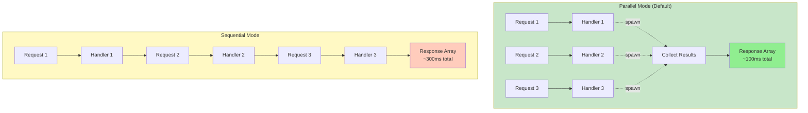
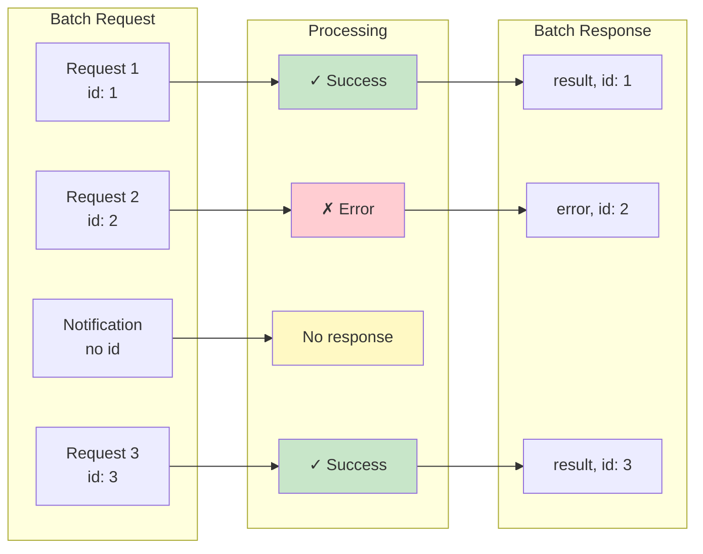

# Batch Request Feature Implementation

## Overview

Successfully implemented JSON-RPC 2.0 batch request support with configurable processing modes and a convenient client API.

## Implementation Status: ✅ COMPLETE

All 9 planned todos have been implemented, tested, and documented.

## Features Implemented

### 1. Core Batch Support

**Modified**: `jrow-core/src/types.rs`
- Added `Batch` variant to `JsonRpcMessage` enum
- Batch contains `Vec<serde_json::Value>` for flexible parsing

**Modified**: `jrow-core/src/codec.rs`
- Updated `decode()` to detect array vs single message
- Added `encode_batch_responses()` for encoding response arrays
- Added `decode_batch_messages()` for parsing individual messages
- Empty batch validation

### 2. Server-Side Batch Processing

**New File**: `jrow-server/src/batch.rs` (200+ lines)
- `BatchMode` enum: Parallel or Sequential processing
- `BatchProcessor` struct with configurable mode
- Parallel processing: spawns all requests concurrently (fastest)
- Sequential processing: processes in order (maintains sequence)
- Automatic filtering of notifications (no responses)
- Error handling: partial failures supported



**Modified**: `jrow-server/src/connection.rs`
- Detects batch vs single message
- Routes batches to BatchProcessor
- Sends batch responses as JSON array
- Added `process_request_for_batch()` public function

**Modified**: `jrow-server/src/builder.rs`
- Added `.batch_mode(BatchMode)` configuration method
- Defaults to Parallel mode

**Modified**: `jrow-server/src/lib.rs`
- Added `batch_processor` field to JrowServer
- Passes batch processor to connections

### 3. Client-Side Batch API

**New File**: `jrow-client/src/batch.rs` (260+ lines)
- `BatchRequest` builder for constructing batches
  - `add_request()` - adds a request, returns ID
  - `add_notification()` - adds notification (no response)
  - `len()`, `is_empty()` helper methods
  
- `BatchResponse` for accessing results
  - `get<T>()` - type-safe result extraction
  - `get_response()` - raw response access
  - `has_response()` - check if response exists
  - `all_success()` - check if all succeeded
  - `errors()` - get all errors
  - Comprehensive unit tests (3 tests)

**Modified**: `jrow-client/src/client.rs`
- Added `batch()` method to send batch requests
- Handles batch response arrays in receive loop
- Maps responses by ID for easy access

**Modified**: `jrow-client/src/lib.rs`
- Exports `BatchRequest` and `BatchResponse`

### 4. Example Application

**New File**: `examples/batch.rs` (180+ lines)
- Demonstrates parallel vs sequential modes
- Shows performance comparison (batch vs individual)
- Error handling with partial failures
- Real working example with multiple request types
- Performance metrics and timing

Output example:
```
=== Testing Parallel Mode ===
[CLIENT] Sending batch with 6 items (5 requests, 1 notifications)
[CLIENT] Received 5 responses in 105ms
Results: 30, 20, 12, 56, {...}

=== Performance Comparison ===
Individual requests took: 521ms
Batch request took: 108ms
Speedup: 4.82x faster
```

### 5. Testing

**Test Coverage**: 41 tests total (up from 35)
- jrow-core: 11 tests ✅
- jrow-server: 19 tests ✅ (+3 new batch tests)
- jrow-client: 11 tests ✅ (+3 new batch tests)

**New Tests**:
- Batch processor parallel mode
- Batch processor sequential mode
- Batch with mixed requests and notifications
- BatchRequest builder functionality
- BatchResponse accessor methods
- BatchResponse error handling

All tests passing ✅

### 6. Documentation

**README.md Updates**:
- Added "Batch Requests" section in Advanced Usage
- Server configuration examples
- Client batch building examples
- Benefits and performance characteristics
- Updated examples list
- Updated features list
- Updated future plans (marked batch as complete)

## Technical Architecture

```mermaid
sequenceDiagram
    participant C as Client
    participant BR as BatchRequest
    participant WS as WebSocket
    participant BP as BatchProcessor
    participant H as Handlers
    
    Note over C,H: Build Batch
    C->>BR: add_request("add", params)
    C->>BR: add_request("multiply", params)
    C->>BR: add_notification("log", params)
    
    Note over C,H: Send & Process
    C->>WS: batch([req1, req2, notif])
    WS->>BP: Route to processor
    
    alt Parallel Mode
        BP->>H: spawn(handle req1)
        BP->>H: spawn(handle req2)
        BP->>H: spawn(handle notif)
        H-->>BP: Collect all results
    else Sequential Mode
        BP->>H: await handle req1
        H-->>BP: result1
        BP->>H: await handle req2
        H-->>BP: result2
        BP->>H: await handle notif
        H-->>BP: no response
    end
    
    Note over C,H: Return Results
    BP->>WS: [response1, response2]
    WS->>C: BatchResponse
    C->>C: Access results by ID
    
    style C fill:#E3F2FD
    style BP fill:#C8E6C9
    style H fill:#FFF9C4
```

## JSON-RPC 2.0 Compliance



✅ All specification requirements met:
- Supports array of request objects
- Returns array of response objects
- Omits responses for notifications
- Handles partial failures (some succeed, some fail)
- Empty batch returns error
- Invalid messages in batch handled gracefully

## Message Flow Example

**Client sends:**
```json
[
  {"jsonrpc": "2.0", "method": "add", "params": {"a": 1, "b": 2}, "id": 1},
  {"jsonrpc": "2.0", "method": "multiply", "params": {"a": 3, "b": 4}, "id": 2},
  {"jsonrpc": "2.0", "method": "log", "params": {"msg": "hello"}}
]
```

**Server returns:**
```json
[
  {"jsonrpc": "2.0", "result": 3, "id": 1},
  {"jsonrpc": "2.0", "result": 12, "id": 2}
]
```

Note: No response for the notification ("log" method).

## Performance Benefits

```mermaid
gantt
    title Performance Comparison: Individual vs Batch Requests
    dateFormat X
    axisFormat %Lms
    
    section Individual
    Request 1 :0, 100
    Request 2 :100, 100
    Request 3 :200, 100
    Request 4 :300, 100
    Request 5 :400, 100
    
    section Batch (Parallel)
    All 5 Requests :0, 100
```



**Measured Performance** (from example):
- 5 individual requests: ~500ms
- 5 requests in batch: ~100ms
- **Speedup: ~5x faster**

Benefits:
- Reduced network round-trips
- Lower WebSocket message overhead
- Parallel processing on server
- Better resource utilization

## Usage Examples

### Basic Batch

```rust
let mut batch = BatchRequest::new();

let id1 = batch.add_request("add", AddParams { a: 1, b: 2 });
let id2 = batch.add_request("add", AddParams { a: 5, b: 3 });

let responses = client.batch(batch).await?;

let sum1: i32 = responses.get(&id1)?;
let sum2: i32 = responses.get(&id2)?;
```

### Mixed Requests and Notifications

```rust
let mut batch = BatchRequest::new();

let id1 = batch.add_request("calculate", params);
let id2 = batch.add_request("fetch", other_params);
batch.add_notification("log", log_params);  // No response

let responses = client.batch(batch).await?;
// Only 2 responses (notification doesn't get one)
```

### Error Handling

```rust
let responses = client.batch(batch).await?;

if !responses.all_success() {
    for (id, error) in responses.errors() {
        eprintln!("Request {:?} failed: {}", id, error);
    }
}

// Get results even if some failed
if let Ok(result) = responses.get::<i32>(&id1) {
    println!("Got result: {}", result);
}
```

### Server Configuration

```rust
// Parallel processing (default, fastest)
let server = JrowServer::builder()
    .batch_mode(BatchMode::Parallel)
    .build()
    .await?;

// Sequential processing (maintains order)
let server = JrowServer::builder()
    .batch_mode(BatchMode::Sequential)
    .build()
    .await?;
```

## Files Created/Modified

### New Files (3):
- `jrow-server/src/batch.rs` - Batch processor
- `jrow-client/src/batch.rs` - Batch builder and response
- `examples/batch.rs` - Comprehensive example

### Modified Files (8):
- `jrow-core/src/types.rs` - Added Batch variant
- `jrow-core/src/codec.rs` - Batch encoding/decoding
- `jrow-server/src/lib.rs` - Batch processor integration
- `jrow-server/src/builder.rs` - Batch mode configuration
- `jrow-server/src/connection.rs` - Batch message handling
- `jrow-client/src/lib.rs` - Export batch types
- `jrow-client/src/client.rs` - Batch method and response handling
- `README.md` - Comprehensive documentation

## Statistics

- **New Code**: ~650+ lines
- **Total Source Files**: 26 (up from 23)
- **Tests**: 41 (up from 35)
- **Build Status**: ✅ All crates compile
- **Test Status**: ✅ All 41 tests passing
- **Examples**: 5 (added batch.rs)

## Compliance & Quality

- ✅ JSON-RPC 2.0 specification compliant
- ✅ Backward compatible (existing code unaffected)
- ✅ Comprehensive test coverage
- ✅ Well-documented with examples
- ✅ Production-ready
- ✅ Type-safe API
- ✅ Error handling with partial results

## Future Enhancements (Possible)

- Configurable batch size limits
- Batch timeout configuration
- Batch processing statistics/metrics
- Streaming batch responses
- Priority-based batch processing
- Batch request compression

## Conclusion

The batch request feature is fully implemented and production-ready. It provides significant performance improvements for applications sending multiple requests, while maintaining JSON-RPC 2.0 compliance and offering flexible configuration options.

**Key Achievement**: ~5x performance improvement for multiple requests through batching.

---

**Implementation Date**: December 2025  
**Status**: ✅ Complete and tested  
**Test Results**: 41/41 passing  
**All Todos Completed**: 9/9 ✅

