# Batch Subscribe/Unsubscribe Implementation

## Overview

This document describes the implementation of batch subscribe and unsubscribe methods for the JROW client, which allow subscribing/unsubscribing to multiple topics in a single network request.

## Implementation Date

December 23, 2025

## Motivation

When managing multiple topic subscriptions, making individual RPC calls for each subscription creates unnecessary network overhead:

- **Multiple round-trips**: N topics = N network requests
- **Higher latency**: Sequential requests add up
- **Inefficient**: Underutilizes the existing batch request infrastructure

The batch subscribe/unsubscribe feature addresses these issues by leveraging the existing JSON-RPC batch request support.

## Features

### 1. Batch Subscribe (`subscribe_batch`)

Subscribe to multiple topics at once with a single batch RPC request.

**Signature:**
```rust
pub async fn subscribe_batch<F, Fut>(&self, topics: Vec<(String, F)>) -> Result<()>
where
    F: Fn(serde_json::Value) -> Fut + Send + Sync + 'static + Clone,
    Fut: std::future::Future<Output = ()> + Send + 'static,
```

**Behavior:**
- Registers all notification handlers first (locally)
- Sends a single batch request with all `rpc.subscribe` calls
- Verifies all subscriptions succeeded
- **Atomic operation**: If any subscription fails, all handlers are rolled back
- Tracks all subscriptions locally

**Example:**
```rust
let topics = vec![
    ("news".to_string(), |data| async move {
        println!("News: {}", data);
    }),
    ("alerts".to_string(), |data| async move {
        println!("Alert: {}", data);
    }),
];

client.subscribe_batch(topics).await?;
```

### 2. Batch Unsubscribe (`unsubscribe_batch`)

Unsubscribe from multiple topics at once with a single batch RPC request.

**Signature:**
```rust
pub async fn unsubscribe_batch(&self, topics: Vec<String>) -> Result<()>
```

**Behavior:**
- Sends a single batch request with all `rpc.unsubscribe` calls
- Removes local handlers and tracking (best effort, even if some server-side unsubscribes fail)
- Non-atomic: Cleans up all local state regardless of server response

**Example:**
```rust
client.unsubscribe_batch(vec![
    "news".to_string(),
    "alerts".to_string(),
]).await?;
```

## Performance Benefits

```mermaid
gantt
    title Subscribe Performance: Individual vs Batch
    dateFormat X
    axisFormat %Lms
    
    section Individual (10 topics)
    Subscribe 1 :0, 0.5
    Subscribe 2 :0.5, 0.5
    Subscribe 3 :1, 0.5
    Subscribe 4 :1.5, 0.5
    Subscribe 5 :2, 0.5
    Subscribe 6 :2.5, 0.5
    Subscribe 7 :3, 0.5
    Subscribe 8 :3.5, 0.5
    Subscribe 9 :4, 0.5
    Subscribe 10 :4.5, 0.5
    
    section Batch (10 topics)
    All Subscribes :0, 1.5
```



Based on the example demonstration:

- **~4x faster** than individual subscribe calls (10 topics: 5.67ms individual vs 1.43ms batch)
- **Single network round-trip** instead of N
- **Reduced server load** from processing one batch instead of N individual requests

## Implementation Details

### Files Modified

1. **`jrow-client/src/client.rs`** (90 lines added)
   - Added `subscribe_batch()` method
   - Added `unsubscribe_batch()` method
   - Both methods leverage the existing `batch()` infrastructure

2. **`README.md`** (38 lines added)
   - Added documentation for batch subscribe/unsubscribe
   - Added usage examples
   - Added performance benefits section

3. **`Cargo.toml`** (18 lines added)
   - Removed `jrow-examples` crate
   - Added root package definition for examples
   - Added dependencies for examples

4. **`examples/pubsub_batch.rs`** (new file, 127 lines)
   - Comprehensive example demonstrating batch subscribe/unsubscribe
   - Performance comparison between individual and batch operations
   - Shows ~4x speed improvement

5. **`src/lib.rs`** (new file)
   - Root library file for workspace
   - Re-exports all sub-crates

### Key Design Decisions

1. **Atomicity for Subscribe**: The `subscribe_batch` method is atomic - if any subscription fails, all handlers are rolled back. This prevents partial subscription states.

2. **Best-effort for Unsubscribe**: The `unsubscribe_batch` method always cleans up local state, even if some server-side unsubscribes fail. This prevents resource leaks.

3. **Reuse Existing Infrastructure**: Both methods use the existing `BatchRequest` and batch processing infrastructure, requiring no server-side changes.

4. **Handler Type Flexibility**: The `subscribe_batch` method accepts closures with the same signature as `subscribe`, maintaining API consistency.

## Testing

### Unit Tests

All existing tests pass:
- 11 tests in `jrow-client`
- 11 tests in `jrow-core`
- 19 tests in `jrow-server`
- Total: 41 tests passing

### Integration Testing

The `examples/pubsub_batch.rs` example provides integration testing:
- ✅ Batch subscribe to 3 topics
- ✅ Batch unsubscribe from 3 topics
- ✅ Performance comparison (10 topics individual vs batch)
- ✅ Demonstrates ~4x performance improvement

## Usage Example

```rust
use jrow_client::JrowClient;

#[tokio::main]
async fn main() -> Result<(), Box<dyn std::error::Error>> {
    let client = JrowClient::connect("ws://127.0.0.1:8080").await?;
    
    // Subscribe to multiple topics at once
    let topics = vec![
        ("news".to_string(), |data| async move {
            println!("News: {}", data);
        }),
        ("alerts".to_string(), |data| async move {
            println!("Alert: {}", data);
        }),
        ("updates".to_string(), |data| async move {
            println!("Update: {}", data);
        }),
    ];
    
    client.subscribe_batch(topics).await?;
    
    // ... receive notifications ...
    
    // Unsubscribe from all topics at once
    client.unsubscribe_batch(vec![
        "news".to_string(),
        "alerts".to_string(),
        "updates".to_string(),
    ]).await?;
    
    Ok(())
}
```

## Compatibility

- **Server-side**: No changes required - uses existing `rpc.subscribe` and `rpc.unsubscribe` methods
- **Client-side**: Fully backward compatible - existing `subscribe()` and `unsubscribe()` methods remain unchanged
- **Protocol**: Uses standard JSON-RPC 2.0 batch requests

## Future Enhancements

Potential improvements for future versions:

1. **Partial Success Handling**: Allow `subscribe_batch` to succeed even if some subscriptions fail, returning which ones succeeded/failed
2. **Subscription Patterns**: Support wildcard patterns for subscribing to multiple related topics
3. **Batch Size Limits**: Add configurable limits for maximum batch size
4. **Retry Logic**: Automatic retry for failed batch subscriptions

## Conclusion

The batch subscribe/unsubscribe feature provides a significant performance improvement for applications managing multiple topic subscriptions, with minimal code changes and full backward compatibility. The ~4x performance improvement makes it especially valuable for applications with many topics or frequent subscription changes.

