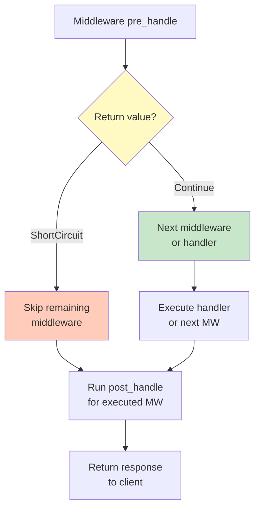
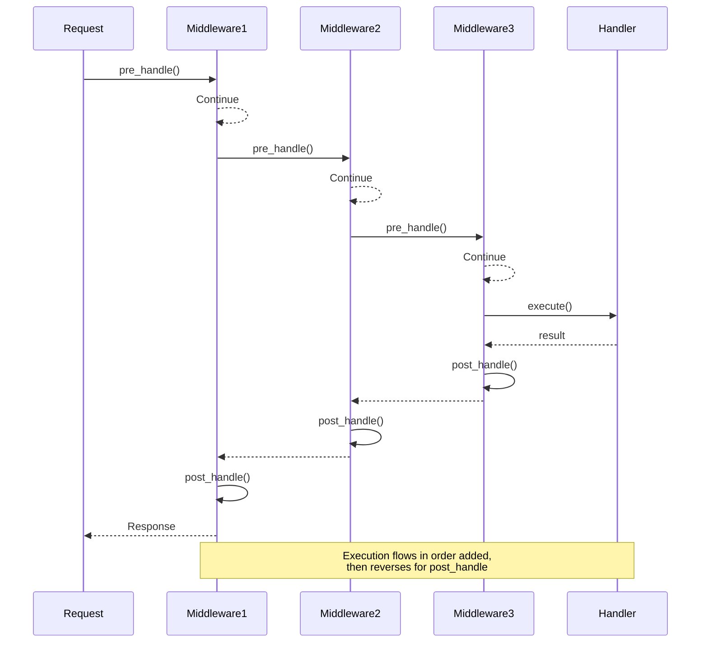
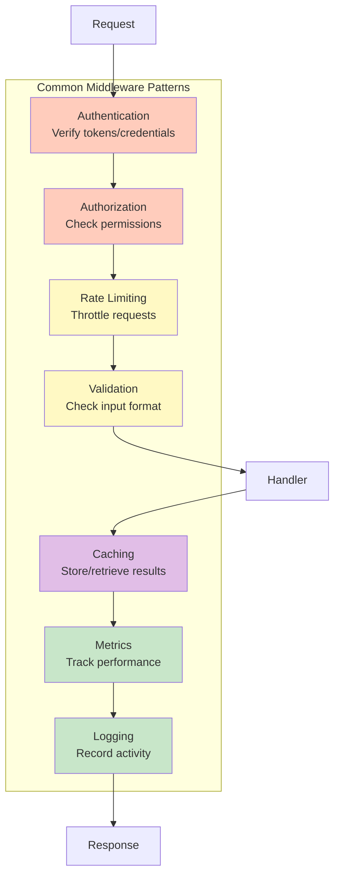

# Middleware System

JROW provides a powerful and flexible middleware system for intercepting and processing requests and responses. Middleware can be used for logging, authentication, rate limiting, metrics collection, request validation, and more.

## Overview

Middleware executes in a chain before and after RPC handlers:


## Quick Start

```rust
use jrow_server::{JrowServer, LoggingMiddleware};

let server = JrowServer::builder()
    .bind_str("127.0.0.1:8080")?
    .use_sync_middleware(LoggingMiddleware::new())
    .handler("method", handler)
    .build()
    .await?;
```

## Built-in Middleware

### LoggingMiddleware

Logs all requests and responses:

```rust
use jrow_server::LoggingMiddleware;

let server = JrowServer::builder()
    .bind_str("127.0.0.1:8080")?
    .use_sync_middleware(LoggingMiddleware::new())
    .build()
    .await?;
```

Output:
```
[Middleware] Request: method=add, conn_id=0
[Middleware] Response: method=add, success=true, result={"sum":8}
```

### MetricsMiddleware

Tracks request counts and latencies:

```rust
use jrow_server::MetricsMiddleware;
use std::sync::Arc;

let metrics = Arc::new(MetricsMiddleware::new());

let server = JrowServer::builder()
    .bind_str("127.0.0.1:8080")?
    .use_middleware(metrics.clone())
    .build()
    .await?;

// Access metrics
println!("Total requests: {}", metrics.get_request_count());
```

Output:
```
[Metrics] method=add, duration=5ms
```

## Custom Middleware

### Synchronous Middleware

For simple, non-async operations:

```rust
use jrow_server::{SyncMiddleware, MiddlewareAction, MiddlewareContext};
use jrow_core::Result;
use serde_json::Value;

struct AuthMiddleware;

impl SyncMiddleware for AuthMiddleware {
    fn pre_handle(&self, ctx: &mut MiddlewareContext) -> Result<MiddlewareAction> {
        // Check if user is authenticated
        if !is_authenticated(ctx.conn_id) {
            // Short-circuit: skip handler and return error
            return Ok(MiddlewareAction::ShortCircuit(
                serde_json::json!({"error": "Unauthorized"})
            ));
        }
        
        // Continue to next middleware/handler
        Ok(MiddlewareAction::Continue)
    }

    fn post_handle(&self, ctx: &mut MiddlewareContext, result: &Result<Value>) -> Result<()> {
        // Log successful authentication
        if result.is_ok() {
            println!("Authenticated request completed for conn_id: {}", ctx.conn_id);
        }
        Ok(())
    }
}
```

### Asynchronous Middleware

For operations requiring I/O (database queries, API calls, etc.):

```rust
use jrow_server::{Middleware, MiddlewareAction, MiddlewareContext};
use async_trait::async_trait;
use jrow_core::Result;
use serde_json::Value;

struct DatabaseMiddleware {
    db_pool: DatabasePool,
}

#[async_trait]
impl Middleware for DatabaseMiddleware {
    async fn pre_handle(&self, ctx: &mut MiddlewareContext) -> Result<MiddlewareAction> {
        // Query database asynchronously
        let user = self.db_pool.get_user(ctx.conn_id).await?;
        
        // Store user in metadata for handler access
        ctx.insert_metadata("user", serde_json::to_value(user)?);
        
        Ok(MiddlewareAction::Continue)
    }

    async fn post_handle(&self, ctx: &mut MiddlewareContext, result: &Result<Value>) -> Result<()> {
        // Log to database
        self.db_pool.log_request(ctx.method.clone(), result.is_ok()).await?;
        Ok(())
    }
}
```

## Middleware Context

The `MiddlewareContext` provides access to request information and allows passing data between middleware:

```rust
pub struct MiddlewareContext {
    pub method: String,              // RPC method name
    pub params: Option<Value>,       // Request parameters
    pub conn_id: u64,                // Connection ID
    pub metadata: HashMap<String, Value>, // Shared metadata
}
```

### Passing Data Between Middleware

```rust
impl SyncMiddleware for Middleware1 {
    fn pre_handle(&self, ctx: &mut MiddlewareContext) -> Result<MiddlewareAction> {
        // Store data
        ctx.insert_metadata("user_id", Value::from(123));
        Ok(MiddlewareAction::Continue)
    }
    
    fn post_handle(&self, _ctx: &mut MiddlewareContext, _result: &Result<Value>) -> Result<()> {
        Ok(())
    }
}

impl SyncMiddleware for Middleware2 {
    fn pre_handle(&self, ctx: &mut MiddlewareContext) -> Result<MiddlewareAction> {
        // Access data from previous middleware
        if let Some(user_id) = ctx.get_metadata("user_id") {
            println!("User ID: {:?}", user_id);
        }
        Ok(MiddlewareAction::Continue)
    }
    
    fn post_handle(&self, _ctx: &mut MiddlewareContext, _result: &Result<Value>) -> Result<()> {
        Ok(())
    }
}
```

## Middleware Actions



### Continue

Proceed to the next middleware or handler:

```rust
Ok(MiddlewareAction::Continue)
```

### Short-Circuit

Skip remaining middleware and handler, return immediately:

```rust
// Return error
Ok(MiddlewareAction::ShortCircuit(
    serde_json::json!({"error": "Rate limit exceeded"})
))

// Return cached result
Ok(MiddlewareAction::ShortCircuit(
    cached_value
))
```

## Execution Order

Middleware executes in the order added:

```rust
let server = JrowServer::builder()
    .bind_str("127.0.0.1:8080")?
    .use_sync_middleware(Middleware1)  // Runs first (pre)
    .use_sync_middleware(Middleware2)  // Runs second (pre)
    .use_sync_middleware(Middleware3)  // Runs third (pre)
    .handler("method", handler)
    .build()
    .await?;
```



Execution flow:
1. Middleware1 pre_handle
2. Middleware2 pre_handle
3. Middleware3 pre_handle
4. Handler
5. Middleware3 post_handle
6. Middleware2 post_handle
7. Middleware1 post_handle

## Common Use Cases



### Authentication

```rust
struct AuthMiddleware {
    valid_tokens: HashSet<String>,
}

impl SyncMiddleware for AuthMiddleware {
    fn pre_handle(&self, ctx: &mut MiddlewareContext) -> Result<MiddlewareAction> {
        // Extract token from params
        let token = extract_token(&ctx.params)?;
        
        if !self.valid_tokens.contains(&token) {
            return Ok(MiddlewareAction::ShortCircuit(
                serde_json::json!({"error": "Invalid token"})
            ));
        }
        
        Ok(MiddlewareAction::Continue)
    }
    
    fn post_handle(&self, _ctx: &mut MiddlewareContext, _result: &Result<Value>) -> Result<()> {
        Ok(())
    }
}
```

### Rate Limiting

```rust
struct RateLimitMiddleware {
    max_requests: u32,
    current: Arc<AtomicU32>,
}

impl SyncMiddleware for RateLimitMiddleware {
    fn pre_handle(&self, ctx: &mut MiddlewareContext) -> Result<MiddlewareAction> {
        let count = self.current.fetch_add(1, Ordering::Relaxed);
        
        if count >= self.max_requests {
            return Ok(MiddlewareAction::ShortCircuit(
                serde_json::json!({"error": "Rate limit exceeded"})
            ));
        }
        
        Ok(MiddlewareAction::Continue)
    }
    
    fn post_handle(&self, _ctx: &mut MiddlewareContext, _result: &Result<Value>) -> Result<()> {
        self.current.fetch_sub(1, Ordering::Relaxed);
        Ok(())
    }
}
```

### Request Validation

```rust
struct ValidationMiddleware;

impl SyncMiddleware for ValidationMiddleware {
    fn pre_handle(&self, ctx: &mut MiddlewareContext) -> Result<MiddlewareAction> {
        // Validate params structure
        if let Some(params) = &ctx.params {
            if !is_valid_params(params) {
                return Ok(MiddlewareAction::ShortCircuit(
                    serde_json::json!({"error": "Invalid parameters"})
                ));
            }
        }
        
        Ok(MiddlewareAction::Continue)
    }
    
    fn post_handle(&self, _ctx: &mut MiddlewareContext, _result: &Result<Value>) -> Result<()> {
        Ok(())
    }
}
```

### Caching

```rust
struct CacheMiddleware {
    cache: Arc<Mutex<HashMap<String, Value>>>,
}

impl SyncMiddleware for CacheMiddleware {
    fn pre_handle(&self, ctx: &mut MiddlewareContext) -> Result<MiddlewareAction> {
        let cache_key = format!("{}:{:?}", ctx.method, ctx.params);
        
        if let Some(cached) = self.cache.lock().unwrap().get(&cache_key) {
            // Return cached result
            return Ok(MiddlewareAction::ShortCircuit(cached.clone()));
        }
        
        Ok(MiddlewareAction::Continue)
    }
    
    fn post_handle(&self, ctx: &mut MiddlewareContext, result: &Result<Value>) -> Result<()> {
        if let Ok(value) = result {
            let cache_key = format!("{}:{:?}", ctx.method, ctx.params);
            self.cache.lock().unwrap().insert(cache_key, value.clone());
        }
        Ok(())
    }
}
```

## Error Handling

Errors in `pre_handle` stop the middleware chain and return an error response. Errors in `post_handle` are logged but don't affect the response (to ensure all middleware `post_handle` methods run).

```rust
impl SyncMiddleware for MyMiddleware {
    fn pre_handle(&self, ctx: &mut MiddlewareContext) -> Result<MiddlewareAction> {
        // This error will be returned to the client
        if some_condition {
            return Err(Error::Internal("Middleware error".to_string()));
        }
        Ok(MiddlewareAction::Continue)
    }
    
    fn post_handle(&self, _ctx: &mut MiddlewareContext, _result: &Result<Value>) -> Result<()> {
        // Errors here are logged but don't affect the response
        Ok(())
    }
}
```

## Best Practices

1. **Keep middleware focused**: Each middleware should do one thing well
2. **Order matters**: Place authentication before rate limiting, logging last
3. **Use short-circuit sparingly**: Only for auth failures, rate limits, caching
4. **Clean up in post_handle**: Release resources, decrement counters
5. **Use metadata for communication**: Pass data between middleware via context
6. **Prefer sync middleware**: Use async only when necessary (I/O operations)
7. **Handle errors gracefully**: Don't panic in middleware
8. **Test middleware independently**: Unit test each middleware in isolation

## Examples

See [`examples/middleware_example.rs`](../examples/middleware_example.rs) for a complete working example demonstrating:
- Built-in middleware (Logging, Metrics)
- Custom authentication middleware
- Custom rate limiting middleware
- Middleware execution order
- Metadata passing

Run the example:
```bash
cargo run --example middleware_example
```

## Performance Considerations

- Middleware adds minimal overhead (nanoseconds per middleware)
- Sync middleware is faster than async middleware
- Short-circuiting skips remaining middleware and handler
- Metadata uses HashMap (O(1) lookups)
- Post-handle always runs for all middleware (even on errors)

