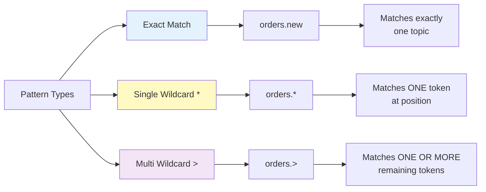
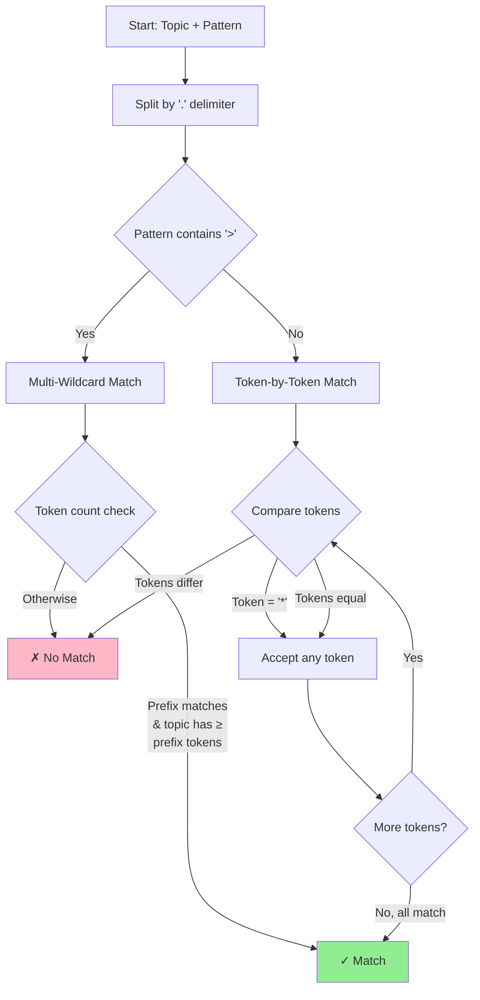
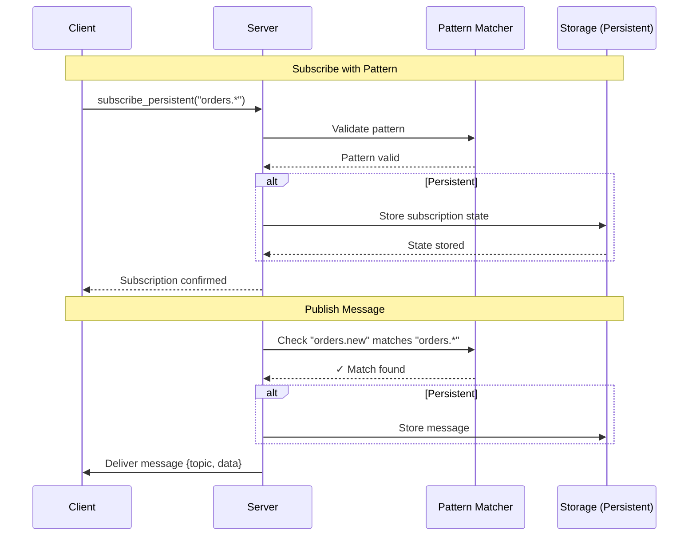
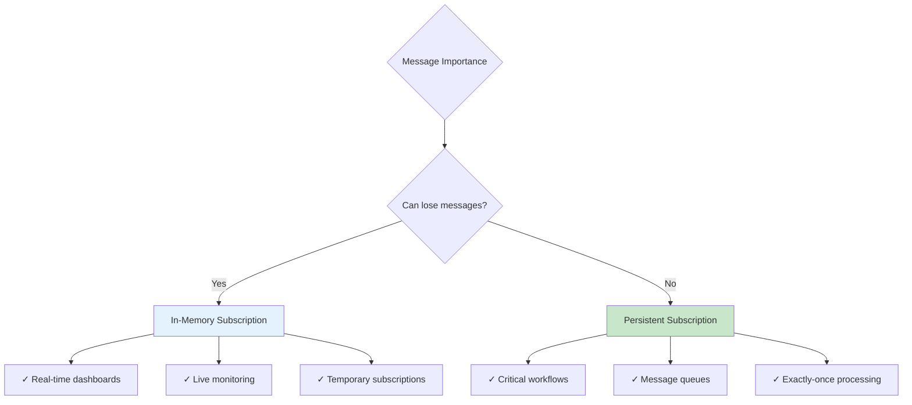

# NATS-Style Pattern Matching

Detailed guide on NATS-style token-based pattern matching for subscriptions.

## Overview

Jrow implements NATS-style pattern matching for **both persistent and in-memory subscriptions**, allowing you to subscribe to multiple topics with a single subscription using wildcards.

**Pattern Types**:
- **Exact**: No wildcards, matches one specific topic
- **Single Wildcard** (`*`): Matches exactly one token at that position
- **Multi Wildcard** (`>`): Matches one or more tokens (must be at end)

**Token Delimiter**: `.` (dot)

## Pattern Syntax



### Exact Match

No wildcards - matches the topic string exactly.

```rust
Pattern: "orders.new"
Matches: "orders.new"
Doesn't match: "orders.shipped", "orders.new.fast", "order.new"
```

### Single Wildcard (`*`)

Matches exactly **one token** at the wildcard position.

```rust
Pattern: "orders.*"
Matches:
  ✓ "orders.new"
  ✓ "orders.shipped"
  ✓ "orders.cancelled"
Doesn't match:
  ✗ "orders" (0 tokens after delimiter)
  ✗ "orders.new.fast" (2 tokens after delimiter)
  ✗ "events.new" (different prefix)
```

**Multiple Single Wildcards**:

```rust
Pattern: "orders.*.*"
Matches:
  ✓ "orders.new.shipped"
  ✓ "orders.old.pending"
Doesn't match:
  ✗ "orders.new" (only 1 token after orders)
  ✗ "orders.new.pending.shipped" (3 tokens after orders)
```

**Wildcard at Beginning**:

```rust
Pattern: "*.login"
Matches:
  ✓ "user.login"
  ✓ "admin.login"
  ✓ "service.login"
Doesn't match:
  ✗ "user.login.success" (2 tokens)
  ✗ "user.logout" (different second token)
```

**Wildcard in Middle**:

```rust
Pattern: "events.*.success"
Matches:
  ✓ "events.payment.success"
  ✓ "events.login.success"
Doesn't match:
  ✗ "events.success" (missing middle token)
  ✗ "events.payment.login.success" (too many tokens)
```

### Multi Wildcard (`>`)

Matches **one or more tokens**. Must be the **last token** in the pattern.

```rust
Pattern: "orders.>"
Matches:
  ✓ "orders.new" (1 token)
  ✓ "orders.new.shipped" (2 tokens)
  ✓ "orders.new.pending.shipped" (3 tokens)
Doesn't match:
  ✗ "orders" (0 tokens - no match)
  ✗ "events.new" (different prefix)
```

**With Prefix**:

```rust
Pattern: "events.user.>"
Matches:
  ✓ "events.user.login"
  ✓ "events.user.login.success"
  ✓ "events.user.logout"
Doesn't match:
  ✗ "events.user" (no tokens after >)
  ✗ "events.admin.login" (different prefix)
```

**Root Wildcard**:

```rust
Pattern: ">"
Matches:
  ✓ "orders"
  ✓ "orders.new"
  ✓ "events.user.login.success"
  ✓ Any topic with at least one token
```

## Pattern Validation Rules

### Valid Patterns

✓ `orders` - Exact match  
✓ `orders.*` - Single wildcard  
✓ `orders.*.shipped` - Wildcard in middle  
✓ `*.*.*` - Multiple wildcards  
✓ `orders.>` - Multi wildcard at end  
✓ `>` - Root multi wildcard  

### Invalid Patterns

❌ `` (empty string) → `EmptyPattern`  
❌ `orders..new` (consecutive dots) → `EmptyToken`  
❌ `ord*` (wildcard + text) → `CombinedWildcard`  
❌ `order*s` (wildcard in middle of word) → `CombinedWildcard`  
❌ `orders.>.new` (> not at end) → `MultiWildcardNotLast`  
❌ `orders.*.>` (mixing wildcards) → `MixedWildcards`  

## Matching Algorithm

### Token-Based Matching

1. **Split** topic and pattern by `.` delimiter into tokens
2. **Compare** tokens one-by-one from left to right
3. **Handle** wildcards:
   - `*` → Accept any single token at this position
   - `>` → Accept all remaining tokens



### Single Wildcard Algorithm

```
Pattern: orders.*.shipped
Topic:   orders.new.shipped

Tokens:
  Pattern: ["orders", "*",    "shipped"]
  Topic:   ["orders", "new",  "shipped"]

Comparison:
  1. "orders" == "orders" ✓
  2. "*" == "new" ✓ (wildcard matches any)
  3. "shipped" == "shipped" ✓

Result: MATCH
```

### Multi Wildcard Algorithm

```
Pattern: orders.>
Topic:   orders.new.pending.shipped

Tokens:
  Pattern prefix: ["orders"]
  Topic:          ["orders", "new", "pending", "shipped"]

Comparison:
  1. "orders" == "orders" ✓
  2. ">" matches remaining ["new", "pending", "shipped"] ✓

Result: MATCH
```

## Performance Characteristics

### Exact Match

**Complexity**: O(1)  
**Method**: Direct hash map lookup  
**Use when**: You need to subscribe to a specific topic  

### Pattern Match

**On Subscribe**:
- **Complexity**: O(1) - Pattern validation and storage
- **Storage**: Pattern stored with subscription

**On Publish**:
- **Complexity**: O(s × t) where:
  - s = number of active subscriptions with patterns
  - t = average number of tokens per pattern
- **Method**: Iterate subscriptions, check if pattern matches topic

**On Resume**:
- **Complexity**: O(n × log m) where:
  - n = number of topics matching the pattern
  - m = average messages per topic
- **Method**: Get all topics, filter by pattern, get messages from each

### Performance Comparison

| Operation | Exact | Pattern |
|-----------|-------|---------|
| Subscribe | O(1) | O(1) |
| Publish (find subs) | O(1) | O(s × t) |
| Resume (get messages) | O(log m) | O(n × log m) |

**Recommendation**: Use exact topics when possible. Use patterns when flexibility is more important than absolute performance.

## In-Memory vs Persistent Pattern Subscriptions

Pattern matching works for both in-memory and persistent subscriptions, but with different characteristics:



### In-Memory Subscriptions

```rust
// Subscribe with pattern
client.subscribe("orders.*", |msg| async move {
    if let Some(obj) = msg.as_object() {
        let topic = obj.get("topic").and_then(|v| v.as_str()).unwrap_or("?");
        let data = obj.get("data").unwrap_or(&msg);
        println!("Order from {}: {}", topic, data);
    }
}).await?;
```

**Characteristics**:
- Real-time only (no persistence)
- Notification data includes `topic` field for pattern subscriptions
- Lighter weight, lower latency
- Lost messages are not recovered
- Best for: Real-time dashboards, live monitoring, temporary subscriptions

### Persistent Subscriptions

```rust
// Subscribe with pattern  
client.subscribe_persistent("order-processor", "orders.>", |msg| async move {
    if let Some(obj) = msg.as_object() {
        let seq_id = obj.get("sequence_id").and_then(|v| v.as_u64()).unwrap();
        let topic = obj.get("topic").and_then(|v| v.as_str()).unwrap();
        let data = obj.get("data").unwrap();
        
        // Process message
        process_order(data).await;
        
        // Acknowledge after successful processing
        client.ack_persistent("order-processor", seq_id);
    }
}).await?;
```

**Characteristics**:
- Exactly-once delivery with acknowledgment
- Automatic resume from last ack'd position
- Notification data includes `sequence_id` and `topic` fields
- Higher overhead for durability
- Best for: Critical workflows, message queues, exactly-once processing

### Choosing Between Them



| Feature | In-Memory | Persistent |
|---------|-----------|------------|
| Delivery guarantee | At-most-once | Exactly-once |
| Message persistence | No | Yes (sled database) |
| Automatic recovery | No | Yes |
| Acknowledgment required | No | Yes |
| Pattern matching | Yes | Yes |
| Notification format | `{topic, data}` | `{sequence_id, topic, data}` |
| Use case | Real-time updates | Critical workflows |

## Use Cases

### 1. Microservices Event Bus

Subscribe to all events from a service:

```rust
client.subscribe_persistent("analytics", "events.>", handler).await?;
```

Receives: `events.user.login`, `events.order.created`, `events.payment.completed`, etc.

### 2. Order Processing Pipeline

Subscribe to specific order states:

```rust
client.subscribe_persistent("shipping", "orders.*.shipped", handler).await?;
```

Receives: `orders.new.shipped`, `orders.old.shipped`, etc.

### 3. Multi-Region Logging

Subscribe to logs from all regions:

```rust
client.subscribe_persistent("log-aggregator", "logs.*.>", handler).await?;
```

Receives: `logs.us-east.error`, `logs.eu-west.warning`, etc.

### 4. Feature-Specific Events

Subscribe to all success events:

```rust
client.subscribe_persistent("metrics", "*.*.success", handler).await?;
```

Receives: `auth.login.success`, `payment.charge.success`, etc.

## Comparison with Glob Patterns

Jrow has two pattern matching systems:

| Feature | NATS Patterns | Glob Patterns |
|---------|---------------|---------------|
| **Used for** | Persistent subscriptions | Regular subscriptions |
| **Delimiter** | `.` (dot) | N/A |
| **Syntax** | `*`, `>` | `*`, `?`, `[...]` |
| **Matching** | Token-based | Character-based |
| **Example** | `orders.*` | `order*` |

**NATS patterns** are structured and token-based - better for hierarchical topics.  
**Glob patterns** are flexible and character-based - better for arbitrary string matching.

## Examples

### Example 1: E-commerce Event Processing

```rust
use jrow_client::JrowClient;

let client = JrowClient::connect("ws://localhost:8080").await?;

// Subscribe to all order events
client.subscribe_persistent("orders", "orders.>", |msg| {
    async move {
        process_order_event(msg).await;
    }
}).await?;

// Subscribe to all payment successes
client.subscribe_persistent("payments", "payment.*.success", |msg| {
    async move {
        record_successful_payment(msg).await;
    }
}).await?;

// Subscribe to all errors from any service
client.subscribe_persistent("errors", "*.error", |msg| {
    async move {
        alert_on_error(msg).await;
    }
}).await?;
```

### Example 2: Multi-Tenant System

```rust
// Subscribe to events for a specific tenant
client.subscribe_persistent(
    "tenant-123",
    "tenant.123.>",
    |msg| async move {
        process_tenant_event(msg).await;
    }
).await?;

// Subscribe to all tenant logins
client.subscribe_persistent(
    "login-auditor",
    "tenant.*.login",
    |msg| async move {
        audit_login(msg).await;
    }
).await?;
```

### Example 3: IoT Device Monitoring

```rust
// Subscribe to all sensor readings from building A
client.subscribe_persistent(
    "building-a-monitor",
    "sensors.building-a.>",
    |msg| async move {
        process_sensor_data(msg).await;
    }
).await?;

// Subscribe to all temperature alerts
client.subscribe_persistent(
    "temp-alerts",
    "sensors.*.temperature.alert",
    |msg| async move {
        handle_temperature_alert(msg).await;
    }
).await?;
```

## Best Practices

### 1. Design Hierarchical Topics

Use consistent hierarchy for better pattern matching:

```rust
// ✅ Good: Clear hierarchy
"service.resource.action"
"orders.new.created"
"users.123.updated"

// ❌ Bad: Flat or inconsistent
"order-new-created"
"user_updated_123"
```

### 2. Start Specific, Then Generalize

Start with exact topics, use patterns when needed:

```rust
// Start specific
client.subscribe_persistent("handler", "orders.new", handler).await?;

// Generalize if needed
client.subscribe_persistent("handler", "orders.*", handler).await?;
```

### 3. Avoid Overly Broad Patterns

The pattern `>` matches everything - usually too broad:

```rust
// ❌ Bad: Receives ALL messages
client.subscribe_persistent("processor", ">", handler).await?;

// ✅ Good: Receives specific category
client.subscribe_persistent("processor", "orders.>", handler).await?;
```

### 4. Use Exact Topics for High-Throughput

For maximum performance on high-volume topics:

```rust
// ✅ Best performance
client.subscribe_persistent("critical", "orders.critical", handler).await?;

// ⚠️ Slightly slower (pattern matching)
client.subscribe_persistent("all-orders", "orders.*", handler).await?;
```

### 5. Document Pattern Semantics

Make pattern meanings clear in code:

```rust
// ✅ Good: Clear intent
client.subscribe_persistent(
    "payment-success-handler",
    "payment.*.success",  // All successful payments
    handler
).await?;
```

## Error Handling

Pattern validation errors are returned at subscribe time:

```rust
use jrow_client::JrowClient;

let result = client.subscribe_persistent(
    "bad-pattern",
    "orders.>.new",  // Invalid: > not at end
    handler
).await;

match result {
    Ok(seq) => println!("Subscribed, resumed from seq {}", seq),
    Err(e) => eprintln!("Invalid pattern: {}", e),
}
```

**Common errors**:
- `EmptyPattern`: Pattern string is empty
- `EmptyToken`: Pattern has consecutive dots (e.g., `orders..new`)
- `CombinedWildcard`: Wildcard combined with text (e.g., `ord*`)
- `MultiWildcardNotLast`: `>` is not the last token
- `MixedWildcards`: Pattern contains both `*` and `>`

## See Also

- [Persistent Subscriptions](persistent-subscriptions.md) - Core persistent subscription features
- [Persistent Batching](persistent-subscriptions-batching.md) - Batch operations

## Examples

**All-in-one demonstration:**
```bash
cargo run --example persistent_pattern_matching
```

**Client-server demonstration** (run in separate terminals to test resume):
```bash
# Terminal 1: Start server (publishes to various topics)
cargo run --example persistent_pattern_server

# Terminal 2: Start client (subscribes with patterns)
cargo run --example persistent_pattern_client

# Try stopping (Ctrl+C) and restarting the client to see automatic resume!
```

See the complete code:
- [`persistent_pattern_matching.rs`](../examples/persistent_pattern_matching.rs) - All-in-one demo
- [`persistent_pattern_server.rs`](../examples/persistent_pattern_server.rs) - Server publishing to various topics
- [`persistent_pattern_client.rs`](../examples/persistent_pattern_client.rs) - Client with pattern subscriptions

