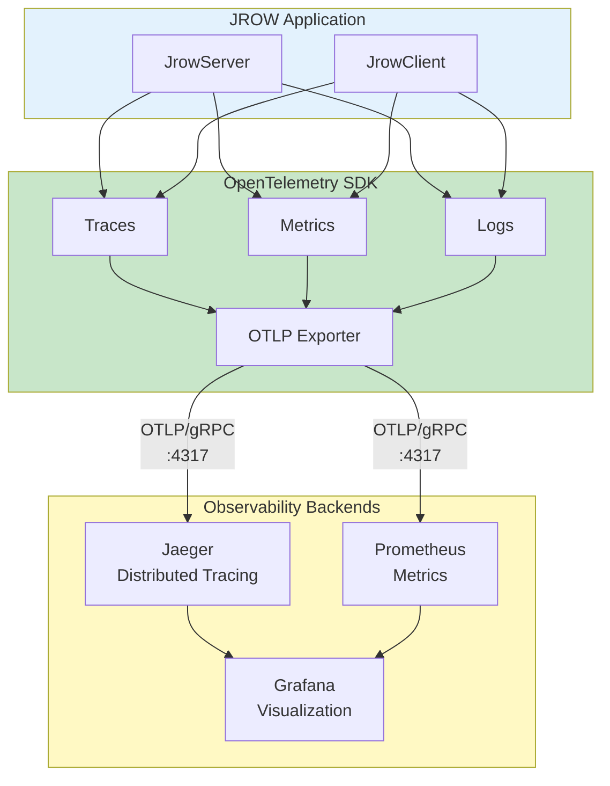
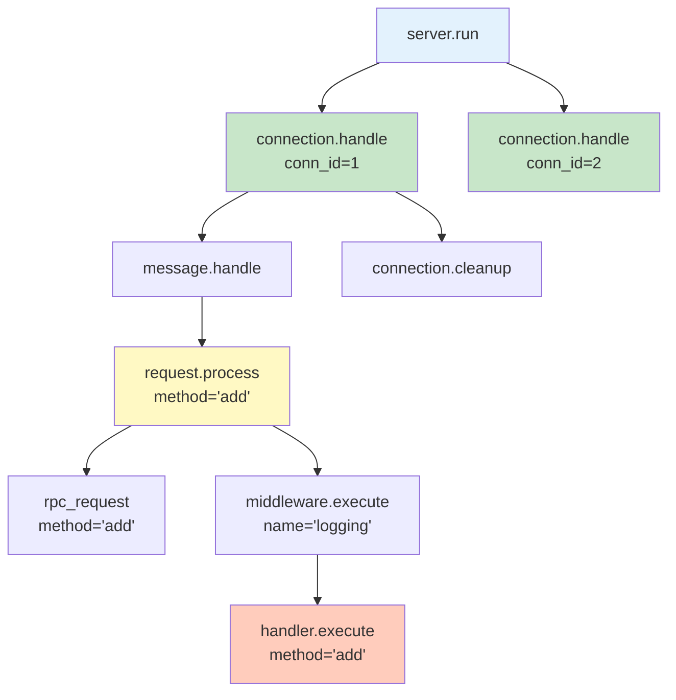

# OpenTelemetry Observability

JROW includes comprehensive OpenTelemetry observability support for distributed tracing, metrics collection, and structured logging.

## Table of Contents

- [Quick Start](#quick-start)
- [Configuration](#configuration)
- [Traces](#traces)
- [Metrics](#metrics)
- [Logs](#logs)
- [Examples](#examples)
- [Backend Integration](#backend-integration)
- [Best Practices](#best-practices)

## Architecture Overview



## Quick Start

### 1. Start Observability Stack

```bash
# Start Jaeger, Prometheus, and Grafana
docker-compose -f templates/deploy/observability/docker-compose.observability.yml up -d

# Access UIs:
# - Jaeger: http://localhost:16686
# - Prometheus: http://localhost:9090
# - Grafana: http://localhost:3000 (admin/admin)
```

### 2. Enable Observability in Server

```rust
use jrow_core::ObservabilityConfig;
use jrow_server::ServerBuilder;

#[tokio::main]
async fn main() -> Result<(), Box<dyn std::error::Error>> {
    // Configure observability
    let otel_config = ObservabilityConfig::new("my-service")
        .with_endpoint("http://localhost:4317")
        .with_log_level("info");

    // Build server with observability
    let server = ServerBuilder::new()
        .bind("127.0.0.1:8080".parse()?)
        // ... handlers ...
        .with_observability(otel_config)
        .build()
        .await?;

    server.run().await?;
    
    // Cleanup on shutdown
    jrow_core::shutdown_observability();
    Ok(())
}
```

### 3. Enable Observability in Client

```rust
use jrow_client::ClientBuilder;
use jrow_core::ObservabilityConfig;

#[tokio::main]
async fn main() -> Result<(), Box<dyn std::error::Error>> {
    let otel_config = ObservabilityConfig::new("my-client")
        .with_endpoint("http://localhost:4317");

    let client = ClientBuilder::new("ws://127.0.0.1:8080")
        .with_observability(otel_config)
        .connect()
        .await?;

    // Your client code...

    jrow_core::shutdown_observability();
    Ok(())
}
```

## Configuration

### ObservabilityConfig

```rust
let config = ObservabilityConfig::new("service-name")
    .with_endpoint("http://localhost:4317")  // OTLP endpoint
    .with_version("1.0.0")                   // Service version
    .with_log_level("info")                  // Log level
    .with_traces(true)                        // Enable tracing
    .with_metrics(true)                       // Enable metrics
    .with_logs(true);                         // Enable logs
```

### Environment Variables

- `OTEL_EXPORTER_OTLP_ENDPOINT`: Default OTLP endpoint
- `RUST_LOG`: Default log level

## Traces

### Automatic Tracing

JROW automatically creates spans for:

- **Server**: Connection handling, request processing, middleware execution
- **Client**: Request sending, response receiving, reconnection attempts
- **Pub/Sub**: Message publishing, subscription management
- **Batch**: Batch processing with size tracking

### Span Hierarchy Example



### Distributed Tracing Flow

```mermaid
sequenceDiagram
    participant C as Client
    participant S as Server
    participant J as Jaeger
    
    Note over C,J: Request with Trace Context
    C->>C: Start span: client.request
    C->>S: RPC request + trace_id + span_id
    
    Note over S: Server creates child span
    S->>S: Start span: server.handle<br/>(parent: client.request)
    S->>S: Execute middleware
    S->>S: Execute handler
    S->>S: End span: server.handle
    
    S-->>C: Response
    C->>C: End span: client.request
    
    Note over C,J: Export to Backend
    C->>J: Export trace data
    S->>J: Export trace data
    
    Note over J: Trace Visualization
    J->>J: Correlate spans by trace_id<br/>Build distributed trace
    
    style C fill:#E3F2FD
    style S fill:#C8E6C9
    style J fill:#FFF9C4
```

### Custom Spans

Add custom spans in your handlers:

```rust
use tracing::instrument;

#[instrument(skip(params), fields(user_id = %params.user_id))]
async fn process_user(params: UserParams) -> Result<UserResult> {
    tracing::info!("Processing user request");
    
    // Your logic with automatic span tracking
    let result = do_work(&params).await?;
    
    tracing::debug!(result_count = result.len(), "Processing complete");
    Ok(result)
}
```

### TracingMiddleware

Use the built-in middleware for automatic request tracing:

```rust
use jrow_server::{ServerBuilder, TracingMiddleware};
use std::sync::Arc;

let server = ServerBuilder::new()
    .bind(addr)
    .use_middleware(Arc::new(TracingMiddleware::new()))
    .build()
    .await?;
```

## Metrics

### Server Metrics

| Metric | Type | Description |
|--------|------|-------------|
| `jrow.server.connections.active` | Gauge | Current active connections |
| `jrow.server.connections.total` | Counter | Total connections established |
| `jrow.server.requests.total` | Counter | Total requests processed |
| `jrow.server.request.duration` | Histogram | Request processing time (seconds) |
| `jrow.server.batch.size` | Histogram | Batch request sizes |
| `jrow.server.subscribers.total` | Gauge | Active subscribers by topic |
| `jrow.server.publish.total` | Counter | Messages published by topic |
| `jrow.server.errors.total` | Counter | Errors by type |

### Client Metrics

| Metric | Type | Description |
|--------|------|-------------|
| `jrow.client.connection.state` | Gauge | Connection state (0-4) |
| `jrow.client.requests.total` | Counter | Total requests sent |
| `jrow.client.request.duration` | Histogram | Request duration (seconds) |
| `jrow.client.errors.total` | Counter | Errors by type |
| `jrow.client.reconnection.attempts` | Counter | Reconnection attempts |
| `jrow.client.reconnection.success` | Counter | Successful reconnections |
| `jrow.client.batch.size` | Histogram | Batch request sizes |
| `jrow.client.notifications.received` | Counter | Notifications by method |

### Metrics Labels

Metrics include contextual labels:
- `method`: RPC method name
- `status`: "success" or "error"
- `topic`: Pub/sub topic
- `error_type`: Error classification
- `mode`: Batch processing mode

## Logs

### Structured JSON Logs

JROW uses structured JSON logging with trace context:

```json
{
  "timestamp": "2025-01-10T12:34:56.789Z",
  "level": "INFO",
  "target": "jrow_server::connection",
  "span": {
    "name": "connection.handle",
    "conn_id": 1
  },
  "trace_id": "4bf92f3577b34da6a3ce929d0e0e4736",
  "span_id": "00f067aa0ba902b7",
  "message": "Request completed successfully"
}
```

### Log Levels

- `ERROR`: Failures and critical issues
- `WARN`: Recoverable problems
- `INFO`: Important events (connections, requests)
- `DEBUG`: Detailed diagnostic information
- `TRACE`: Very verbose debugging

## Examples

### Basic Server with Observability

```bash
# Terminal 1: Start observability stack
docker-compose -f templates/deploy/observability/docker-compose.observability.yml up

# Terminal 2: Run server
cargo run --example observability_server

# Terminal 3: Run client
cargo run --example observability_client
```

### Full Example with All Features

```bash
cargo run --example observability_full
```

This demonstrates:
- Distributed tracing across client-server
- Pub/sub with tracing
- Batch requests with metrics
- Reconnection with spans

### View Results

1. **Jaeger UI**: http://localhost:16686
   - Search for service: `observability-server` or `observability-client`
   - View distributed traces across components
   - Analyze request latencies

2. **Prometheus**: http://localhost:9090
   - Query metrics: `jrow_server_requests_total`
   - Create dashboards

3. **Grafana**: http://localhost:3000
   - Login: admin/admin
   - Create visualizations from Prometheus and Jaeger data

## Backend Integration

### Jaeger (Tracing)

```yaml
# docker-compose.yml
jaeger:
  image: jaegertracing/all-in-one:latest
  ports:
    - "16686:16686"  # UI
    - "4317:4317"    # OTLP gRPC
```

### Prometheus (Metrics)

Configure Prometheus to scrape OTLP metrics or use a collector.

### Other Backends

JROW uses standard OTLP, compatible with:
- **Grafana Tempo**: Distributed tracing
- **Grafana Loki**: Log aggregation
- **Datadog**: Full observability platform
- **New Relic**: APM and monitoring
- **Honeycomb**: Observability platform
- **AWS X-Ray**: Distributed tracing
- **Google Cloud Trace**: Tracing service

Simply configure the OTLP endpoint:

```rust
ObservabilityConfig::new("my-service")
    .with_endpoint("https://your-backend:4317")
```

## Best Practices

### 1. Service Naming

Use descriptive, hierarchical names:

```rust
ObservabilityConfig::new("company.product.component")
```

### 2. Sampling

For high-traffic services, configure sampling rates (currently always-on):

```rust
// Future: Configure sampler in observability module
```

### 3. Attribute Cardinality

Avoid high-cardinality attributes in spans:

```rust
// ❌ Bad: User IDs in span names
tracing::info_span!("process_user", user_id = user_id);

// ✅ Good: User IDs as attributes
tracing::info!(user_id = user_id, "Processing user");
```

### 4. Error Handling

Always record errors with context:

```rust
if let Err(e) = operation().await {
    tracing::error!(error = %e, "Operation failed");
    metrics.record_error("operation_failed");
}
```

### 5. Performance

- Use `debug!` and `trace!` for verbose logs
- Enable only needed features (traces/metrics/logs)
- Configure appropriate log levels

### 6. Cleanup

Always call shutdown on graceful exit:

```rust
// Ensure telemetry is flushed
jrow_core::shutdown_observability();
```

### 7. Development vs Production

```rust
let config = if cfg!(debug_assertions) {
    ObservabilityConfig::new("my-service-dev")
        .with_log_level("debug")
} else {
    ObservabilityConfig::new("my-service")
        .with_log_level("info")
};
```

## Troubleshooting

### No Traces Appearing

1. Check OTLP endpoint is accessible
2. Verify `enable_traces = true`
3. Check Jaeger is running: `docker ps`
4. Look for connection errors in logs

### Metrics Not Updating

1. Ensure `enable_metrics = true`
2. Wait for export interval (30 seconds default)
3. Check metric collection backend

### High Memory Usage

1. Reduce log level to `info` or `warn`
2. Configure sampling (when available)
3. Check for trace context leaks

## Migration Guide

### From No Observability

1. Add dependencies (already included in JROW)
2. Configure observability in builders
3. No code changes needed - automatic instrumentation

### Custom Instrumentation

Existing `tracing` instrumentation works automatically:

```rust
#[instrument]
async fn my_function() {
    tracing::info!("This automatically appears in traces");
}
```

## License

Observability features are part of JROW and follow the same license.

