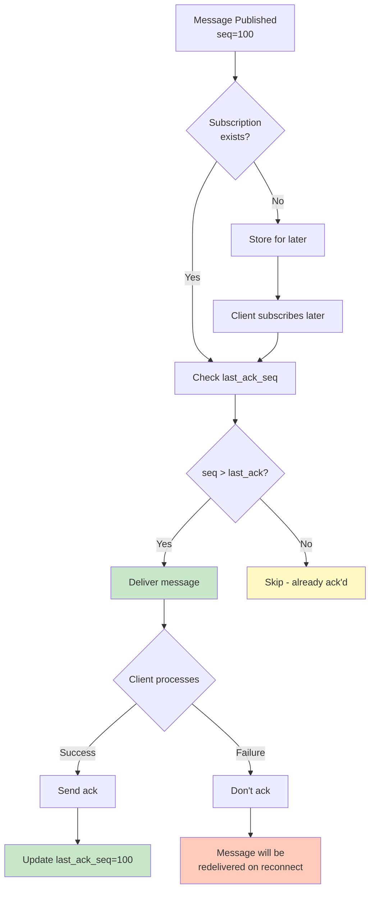
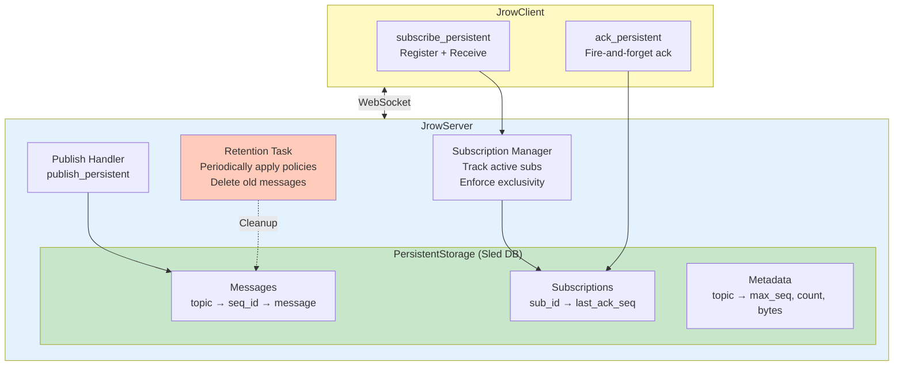
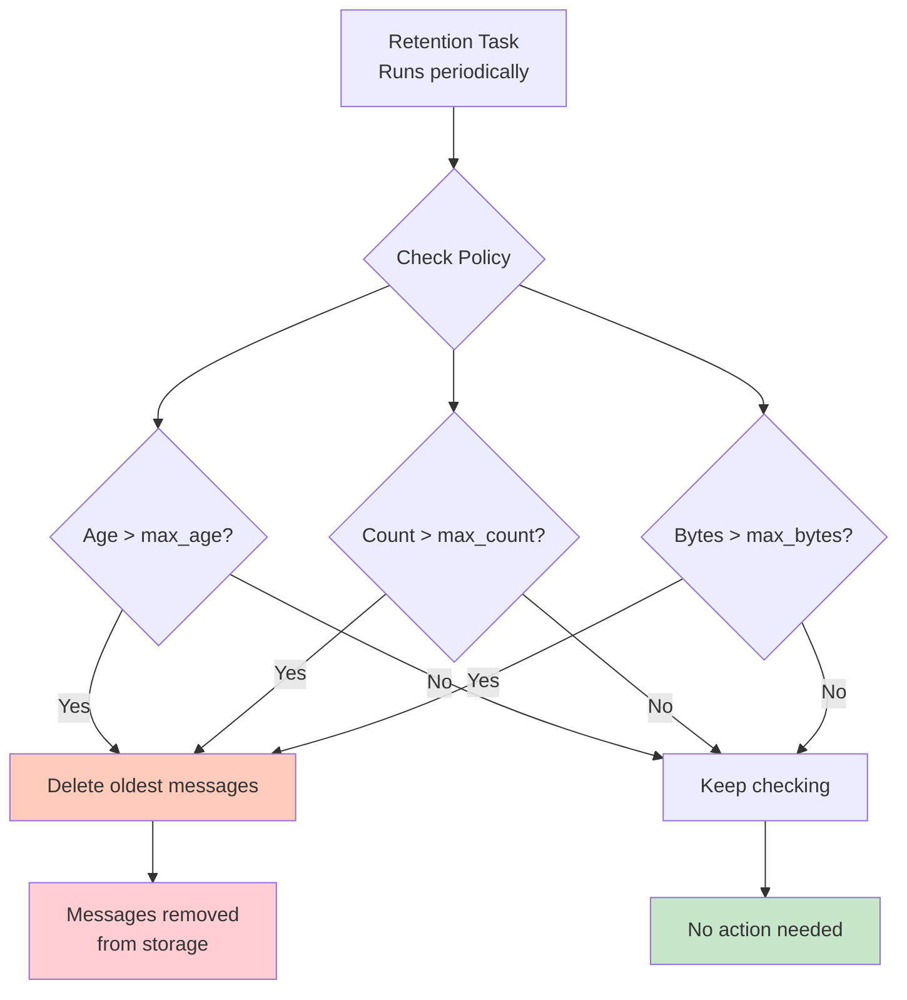

# Persistent Subscriptions

Persistent subscriptions provide reliable, exactly-once message delivery semantics with automatic recovery and state management. Built on top of JROW's pub/sub system, persistent subscriptions ensure that messages are never lost and are processed exactly once, even across client disconnections and restarts.

## Table of Contents

- [Overview](#overview)
- [Key Features](#key-features)
- [Architecture](#architecture)
- [Getting Started](#getting-started)
- [API Reference](#api-reference)
- [Configuration](#configuration)
- [Message Lifecycle](#message-lifecycle)
- [Best Practices](#best-practices)
- [Examples](#examples)
- [Troubleshooting](#troubleshooting)

## Overview

Traditional pub/sub systems deliver messages only to currently connected subscribers. If a client disconnects or crashes, any messages published during that time are lost. Persistent subscriptions solve this by:

1. **Storing messages** in a durable database (sled)
2. **Tracking subscription state** including the last acknowledged position
3. **Automatically resuming** from the last acknowledged message on reconnection
4. **Guaranteeing exactly-once delivery** through manual acknowledgment

### Use Cases

- **Event Processing**: Process events reliably without loss
- **Task Queues**: Distribute work among workers with guaranteed delivery
- **Audit Logs**: Ensure every audit event is processed
- **Data Synchronization**: Keep systems in sync with reliable message delivery
- **Order Processing**: Process orders exactly once without duplicates

## Key Features

### ✅ Exactly-Once Delivery

Each message is delivered exactly once to each subscription, preventing duplicates and ensuring consistent processing.



```rust
client.subscribe_persistent("order-processor", "orders", |msg| async {
    process_order(msg).await;
    // Acknowledged automatically after handler completes
}).await?;
```

### ✅ Automatic Resume

Subscriptions automatically resume from the last acknowledged position when reconnecting:

```rust
// First run: processes messages 1-10, then disconnects
// Second run: automatically resumes from message 11
let resumed_seq = client
    .subscribe_persistent("my-sub", "events", handler)
    .await?;
println!("Resumed from sequence: {}", resumed_seq);
```

### ✅ Persistent Storage

All messages and subscription state are stored in an embedded sled database, surviving server restarts.

### ✅ Retention Policies

Automatically clean up old messages based on age, count, or size:

```rust
.register_topic(
    "events",
    RetentionPolicy {
        max_age: Some(Duration::from_secs(3600)),     // Keep 1 hour
        max_count: Some(1000),                         // Keep last 1000
        max_bytes: Some(10 * 1024 * 1024),            // Keep 10MB
    },
)
```

### ✅ Exclusive Subscriptions

Each subscription ID can only be active on one connection at a time, preventing duplicate processing:

```rust
// Only one client can use "order-processor-1" at a time
client.subscribe_persistent("order-processor-1", "orders", handler).await?;
```

### ✅ Manual Acknowledgment

Messages are acknowledged after successful processing, enabling retry on failure:

```rust
client.subscribe_persistent("my-sub", "events", |msg| {
    async move {
        if let Ok(data) = process(msg).await {
            // Acknowledge on success (spawns internally, non-blocking)
            client.ack_persistent("my-sub", seq_id);
        }
        // On failure, don't ack - message will be redelivered
    }
}).await?;
```

## Architecture

### Components



### Data Model

#### Messages
```rust
{
    sequence_id: u64,           // Unique, monotonic sequence number
    topic: String,              // Topic name
    data: serde_json::Value,    // Message payload
    timestamp: u64,             // Unix timestamp (milliseconds)
    size_bytes: usize,          // Message size for retention
}
```

#### Subscription State
```rust
{
    subscription_id: String,    // Unique subscription identifier
    topic: String,              // Subscribed topic
    last_ack_seq: u64,         // Last acknowledged sequence ID
    created_at: u64,           // Creation timestamp
}
```

### Storage Layout

Sled database structure:
```
messages:{topic}:{seq_id}     → PersistentMessage (bincode)
subscriptions:{sub_id}        → SubscriptionState (bincode)
metadata:{topic}              → TopicMetadata (bincode)
```

## Getting Started

### Server Setup

```rust
use jrow_server::{JrowServer, RetentionPolicy};
use std::time::Duration;

#[tokio::main]
async fn main() -> Result<(), Box<dyn std::error::Error>> {
    // Create server with persistent storage
    let server = JrowServer::builder()
        .bind_str("127.0.0.1:9004")?
        .with_persistent_storage("./data/events.db")
        .register_topic(
            "events",
            RetentionPolicy {
                max_age: Some(Duration::from_secs(3600)),
                max_count: Some(1000),
                max_bytes: Some(10 * 1024 * 1024),
            },
        )
        .subscription_timeout(Duration::from_secs(300))
        .retention_interval(Duration::from_secs(60))
        .build()
        .await?;

    // Publish messages
    let seq = server
        .publish_persistent("events", serde_json::json!({
            "event": "user.created",
            "user_id": 123
        }))
        .await?;
    
    println!("Published with sequence: {}", seq);

    server.run().await?;
    Ok(())
}
```

### Client Subscription

```rust
use jrow_client::JrowClient;

#[tokio::main]
async fn main() -> Result<(), Box<dyn std::error::Error>> {
    let client = JrowClient::connect("ws://127.0.0.1:9004").await?;

    // Subscribe with persistent tracking
    client
        .subscribe_persistent("event-processor-1", "events", |msg| {
            let client_clone = client.clone();
            async move {
                if let Some(obj) = msg.as_object() {
                    if let Some(seq_id) = obj.get("sequence_id").and_then(|v| v.as_u64()) {
                        // Process message
                        println!("Processing: {:?}", msg);
                        
                        // Acknowledge (non-blocking)
                        client_clone.ack_persistent("event-processor-1", seq_id);
                    }
                }
            }
        })
        .await?;

    // Keep client running
    tokio::signal::ctrl_c().await?;
    Ok(())
}
```

## API Reference

### Server API

#### `ServerBuilder::with_persistent_storage(path: impl AsRef<Path>)`

Enables persistent subscriptions with the specified database path.

```rust
let server = JrowServer::builder()
    .bind_str("127.0.0.1:9004")?
    .with_persistent_storage("./data/db")
    .build()
    .await?;
```

#### `ServerBuilder::register_topic(topic: impl Into<String>, policy: RetentionPolicy)`

Registers a topic with a retention policy.

```rust
.register_topic(
    "events",
    RetentionPolicy {
        max_age: Some(Duration::from_secs(3600)),
        max_count: Some(1000),
        max_bytes: Some(10 * 1024 * 1024),
    },
)
```

#### `ServerBuilder::subscription_timeout(duration: Duration)`

Sets the inactivity timeout for subscriptions (default: no timeout).

```rust
.subscription_timeout(Duration::from_secs(300)) // 5 minutes
```

#### `ServerBuilder::retention_interval(duration: Duration)`

Sets how often retention policies are enforced (default: 60 seconds).

```rust
.retention_interval(Duration::from_secs(30)) // Check every 30 seconds
```

#### `JrowServer::publish_persistent(topic: impl Into<String>, data: serde_json::Value) -> Result<u64>`

Publishes a message to persistent storage and active subscribers.

```rust
let sequence_id = server
    .publish_persistent("events", serde_json::json!({
        "event": "data.updated",
        "value": 42
    }))
    .await?;
```

**Returns**: The sequence ID of the stored message.

### Client API

#### `JrowClient::subscribe_persistent<F, Fut>(subscription_id: impl Into<String>, topic: impl Into<String>, handler: F) -> Result<u64>`

Creates a persistent subscription.

```rust
let resumed_seq = client
    .subscribe_persistent("my-subscription", "events", |msg| {
        async move {
            // Process message
        }
    })
    .await?;

println!("Resumed from sequence: {}", resumed_seq);
```

**Parameters**:
- `subscription_id`: Unique identifier for this subscription
- `topic`: Topic to subscribe to
- `handler`: Async function to handle incoming messages

**Returns**: The last acknowledged sequence ID (0 for new subscriptions).

**Throws**: `Error::InvalidRequest` if subscription is already active on another connection.

#### `JrowClient::ack_persistent(subscription_id: impl Into<String>, sequence_id: u64)`

Acknowledges a message (fire-and-forget, non-blocking).

```rust
// Safe to call from message handler - spawns internally
client.ack_persistent("my-subscription", seq_id);
```

**Note**: This method spawns a background task and returns immediately. For awaitable acknowledgment, use `ack_persistent_await`.

#### `JrowClient::ack_persistent_await(subscription_id: impl Into<String>, sequence_id: u64) -> Result<()>`

Acknowledges a message and waits for confirmation.

```rust
// Wait for acknowledgment to complete
client.ack_persistent_await("my-subscription", seq_id).await?;
```

**⚠️ Warning**: Do not call this from within a message handler as it may cause deadlocks. Use `ack_persistent` instead.

#### `JrowClient::unsubscribe_persistent(subscription_id: impl Into<String>) -> Result<()>`

Unsubscribes from a persistent subscription.

```rust
client.unsubscribe_persistent("my-subscription").await?;
```

**Note**: The subscription state is preserved in storage. You can resubscribe later to resume from the last acknowledged position.

## Pattern Matching

Persistent subscriptions support NATS-style token-based pattern matching, allowing you to subscribe to multiple topics with a single subscription.

### Pattern Syntax

**Token Delimiter**: `.` (dot) separates tokens  
**Single Wildcard**: `*` matches exactly ONE token  
**Multi Wildcard**: `>` matches ONE OR MORE tokens (must be at end)

### Examples

| Pattern | Matches | Doesn't Match |
|---------|---------|---------------|
| `orders.new` | `orders.new` only | `orders.shipped` |
| `orders.*` | `orders.new`, `orders.shipped` | `orders`, `orders.new.fast` |
| `orders.>` | `orders.new`, `orders.new.shipped` | `orders`, `events.new` |
| `*.login` | `user.login`, `admin.login` | `user.logout`, `user.login.success` |
| `events.*.success` | `events.payment.success` | `events.success`, `events.payment.failure` |

### Usage

Patterns work exactly like exact topics - just pass the pattern as the topic parameter:

```rust
// Exact topic (existing behavior)
client.subscribe_persistent("sub-1", "orders.new", handler).await?;

// Single wildcard pattern
client.subscribe_persistent("sub-2", "orders.*", handler).await?;
// Receives: orders.new, orders.shipped, orders.cancelled

// Multi wildcard pattern
client.subscribe_persistent("sub-3", "events.>", handler).await?;
// Receives: events.user, events.user.login, events.user.login.success
```

### How It Works

1. **On Subscribe**: Pattern is validated and stored with the subscription
2. **On Publish**: Server finds all subscriptions whose patterns match the published topic
3. **Message Delivery**: Messages are delivered to the matching subscription
4. **On Resume**: All messages from topics matching the pattern are retrieved

**Example**:

```rust
// Subscribe with pattern
client.subscribe_persistent("order-processor", "orders.*", |msg| {
    async move {
        // Will receive messages from:
        // - orders.new
        // - orders.shipped
        // - orders.cancelled
        // etc.
        process_order(msg).await;
    }
}).await?;

// Publish to different topics
server.publish_persistent("orders.new", data1).await?;      // ✓ Received
server.publish_persistent("orders.shipped", data2).await?;  // ✓ Received
server.publish_persistent("events.new", data3).await?;      // ✗ Not received
```

### Pattern Rules

**Valid Patterns**:
- `orders` - Exact match
- `*` - Single wildcard alone (matches any single-token topic)
- `orders.*` - Single wildcard at end
- `*.new` - Single wildcard at beginning
- `orders.*.shipped` - Single wildcard in middle
- `orders.*.*` - Multiple single wildcards
- `orders.>` - Multi wildcard at end
- `>` - Multi wildcard alone (matches any topic)

**Invalid Patterns**:
- `orders..new` - Empty token (consecutive dots)
- `ord*` - Wildcard combined with text
- `orders.>.new` - Multi wildcard not at end
- `orders.*.>` - Mixing wildcard types

### Performance Considerations

**Exact Topics**: O(1) lookup - Direct hash map access  
**Patterns**: O(n) where n = number of active subscriptions - Must check each pattern

**Best Practices**:
- Use exact topics when possible for best performance
- Use patterns when you need flexibility
- Be specific: `orders.*.shipped` is better than `>` for performance

**Message Retrieval on Resume**:
- Exact: Gets messages from one topic
- Pattern: Gets messages from all matching topics, sorted by (topic, sequence_id)

### Example: Multi-Topic Processing

```rust
use jrow_client::JrowClient;

let client = JrowClient::connect("ws://localhost:8080").await?;

// Subscribe to all order events with one subscription
let resumed_seq = client
    .subscribe_persistent("all-orders", "orders.>", move |msg| {
        async move {
            if let Some(obj) = msg.as_object() {
                let seq_id = obj.get("sequence_id").and_then(|v| v.as_u64()).unwrap();
                let data = obj.get("data").unwrap();
                
                // Process any order event
                println!("Order event: {}", data);
                
                // Acknowledge after processing
                client.ack_persistent("all-orders", seq_id);
            }
        }
    })
    .await?;

println!("Subscribed! Resumed from sequence {}", resumed_seq);
```

**Examples:**

See [`examples/persistent_pattern_matching.rs`](../examples/persistent_pattern_matching.rs) for an all-in-one demonstration, or try the client-server examples:

```bash
# Terminal 1: Start server
cargo run --example persistent_pattern_server

# Terminal 2: Start client (try stopping and restarting!)
cargo run --example persistent_pattern_client
```

## Configuration

### Retention Policy

Control when old messages are deleted:



```rust
RetentionPolicy {
    max_age: Some(Duration::from_secs(3600)),    // Delete older than 1 hour
    max_count: Some(1000),                        // Keep last 1000 messages
    max_bytes: Some(10 * 1024 * 1024),           // Keep up to 10MB
}
```

**Behavior**: Messages are deleted when **ANY** limit is exceeded.

**Special Values**:
- `None` - No limit for that criteria
- `Some(0)` - Effectively disables storage (not recommended)

### Subscription Timeout

Inactive subscriptions can be cleaned up automatically:

```rust
.subscription_timeout(Duration::from_secs(300))  // 5 minutes
```

**When it triggers**: A subscription is considered inactive if no connection has been active for the specified duration.

**Set to `None`**: Subscriptions never timeout (recommended for most cases).

### Retention Interval

How often the retention task runs to enforce policies:

```rust
.retention_interval(Duration::from_secs(60))  // Check every minute
```

**Trade-offs**:
- **Shorter intervals**: More precise retention, higher CPU usage
- **Longer intervals**: Less overhead, messages may exceed limits temporarily

## Message Lifecycle

```mermaid
sequenceDiagram
    participant S as Server
    participant DB as Storage
    participant C1 as Client 1<br/>(subscribed)
    participant C2 as Client 2<br/>(offline)
    
    Note over S,C2: 1. Publishing
    S->>DB: Store message (seq=100)
    DB-->>S: Stored
    S->>C1: Deliver message
    Note over C2: Offline - message<br/>stored for later
    
    Note over S,C2: 2. Processing & Acknowledgment
    C1->>C1: Process message
    C1->>S: ack_persistent(seq=100)
    S->>DB: Update last_ack_seq=100
    
    Note over S,C2: 3. Resume after reconnect
    C2->>S: subscribe_persistent
    S->>DB: Get last_ack_seq
    DB-->>S: last_ack_seq=95
    S->>DB: Get messages > 95
    DB-->>S: [96, 97, ..., 100]
    S->>C2: Deliver missed messages
    
    Note over S,C2: 4. Retention
    S->>DB: Apply retention policy
    DB->>DB: Delete old messages
    
    style S fill:#E3F2FD
    style DB fill:#C8E6C9
    style C1 fill:#FFF9C4
    style C2 fill:#FFCCBC
```

### 1. Publishing

```rust
// Server publishes a message
let seq = server.publish_persistent("events", data).await?;
```

1. Message is assigned a monotonic sequence ID
2. Message is stored in sled database
3. Message is delivered to active subscribers (if any)
4. Sequence ID is returned to caller

### 2. Delivery

```
Client subscribes → Server checks subscription state → Delivers unacknowledged messages
                                                     ↓
                                        Then delivers new messages as published
```

**On first subscribe**:
1. Subscription is created with `last_ack_seq = 0`
2. All stored messages are delivered

**On resubscribe**:
1. Subscription state is loaded from storage
2. Messages with `seq_id > last_ack_seq` are delivered
3. New messages are delivered as published

### 3. Acknowledgment

```rust
// Client acknowledges message
client.ack_persistent(subscription_id, seq_id);
```

1. Client sends acknowledgment RPC to server
2. Server updates `last_ack_seq` in storage
3. Server marks message as delivered for this subscription

**Acknowledgment is per-subscription**: Different subscriptions to the same topic track acknowledgments independently.

### 4. Retention

```
Retention Task (runs periodically) → Checks policies → Deletes old messages
```

Messages are deleted when:
- Age exceeds `max_age`, OR
- Message count exceeds `max_count`, OR
- Total size exceeds `max_bytes`

**Deletion order**: Oldest messages first (by sequence ID).

## Best Practices

### 1. Choose Meaningful Subscription IDs

Use descriptive, stable identifiers:

```rust
// ✅ Good: Describes purpose and instance
"order-processor-instance-1"
"audit-logger"
"analytics-worker-eu-west"

// ❌ Bad: Random or session-specific
"subscription-abc123"
"temp-sub"
```

### 2. Handle Errors Gracefully

```rust
client.subscribe_persistent("my-sub", "events", |msg| {
    async move {
        match process_message(msg).await {
            Ok(seq_id) => {
                // Acknowledge on success
                client.ack_persistent("my-sub", seq_id);
            }
            Err(e) => {
                // Log error, don't acknowledge
                // Message will be redelivered
                eprintln!("Processing failed: {}", e);
            }
        }
    }
}).await?;
```

### 3. Use Appropriate Retention Policies

**High-volume topics**: Aggressive retention to prevent database bloat
```rust
RetentionPolicy {
    max_age: Some(Duration::from_secs(300)),      // 5 minutes
    max_count: Some(10_000),
    max_bytes: Some(100 * 1024 * 1024),           // 100MB
}
```

**Critical audit logs**: Generous retention
```rust
RetentionPolicy {
    max_age: Some(Duration::from_secs(86400 * 30)), // 30 days
    max_count: None,                                  // No limit
    max_bytes: Some(1024 * 1024 * 1024),             // 1GB
}
```

### 4. Unsubscribe Before Quick Reconnect

For immediate reconnection with the same subscription ID:

```rust
// Explicitly unsubscribe before disconnecting
client.unsubscribe_persistent("my-sub").await?;
drop(client);

// Reconnect immediately
let client = JrowClient::connect(url).await?;
client.subscribe_persistent("my-sub", "events", handler).await?;
```

**Why**: Connection cleanup is asynchronous. Explicit unsubscribe releases the exclusive lock immediately.

### 5. Monitor Subscription Lag

Track the difference between the latest sequence and last acknowledged sequence:

```rust
let latest_seq = server.get_topic_max_seq("events").await?;
let last_ack = client.get_subscription_seq("my-sub").await?;
let lag = latest_seq - last_ack;

if lag > THRESHOLD {
    warn!("Subscription lag: {}", lag);
}
```

### 6. Use Idempotent Processing

Design message handlers to be idempotent in case of redelivery:

```rust
async fn process_message(msg: &Message) -> Result<()> {
    // Check if already processed (e.g., via database unique constraint)
    if is_already_processed(&msg.id).await? {
        return Ok(()); // Skip
    }
    
    // Process message
    do_work(msg).await?;
    
    // Mark as processed
    mark_processed(&msg.id).await?;
    Ok(())
}
```

## Examples

### Complete Server and Client

See the working examples:

- **[persistent_server.rs](../examples/persistent_server.rs)** - Server that publishes events every 10 seconds
- **[persistent_client.rs](../examples/persistent_client.rs)** - Client that processes events with persistence
- **[persistent_pubsub.rs](../examples/persistent_pubsub.rs)** - All-in-one example demonstrating features

Run the examples:

```bash
# Terminal 1: Start server
cargo run --example persistent_server

# Terminal 2: Start client
cargo run --example persistent_client

# Stop client (Ctrl+C), wait, then restart to see resume
cargo run --example persistent_client
```

See the examples above for detailed demonstrations.

### Multiple Subscribers (Fan-out)

Multiple subscriptions can subscribe to the same topic:

```rust
// Order processor
client1.subscribe_persistent("order-processor", "orders", process_order).await?;

// Analytics
client2.subscribe_persistent("analytics", "orders", analyze_order).await?;

// Audit logger
client3.subscribe_persistent("audit", "orders", log_order).await?;
```

Each subscription independently tracks its own acknowledgment state.

### Load Balancing (Competing Consumers)

For load balancing, **use different clients with the SAME subscription ID**:

```rust
// Worker 1
let client1 = JrowClient::connect(url).await?;
client1.subscribe_persistent("worker-pool", "tasks", process_task).await?;

// Worker 2 (on different machine)
let client2 = JrowClient::connect(url).await?;
// This will fail with "already active" until client1 disconnects
client2.subscribe_persistent("worker-pool", "tasks", process_task).await?;
```

**Note**: Currently, only one connection can use a subscription ID at a time. For true load balancing with multiple concurrent consumers, you would need to use different subscription IDs or implement a client-side coordinator.

## Troubleshooting

### "Subscription already active on another connection"

**Cause**: The subscription ID is currently in use by another connection.

**Solutions**:
1. Wait for the previous connection to close (may take a few seconds)
2. Explicitly unsubscribe before reconnecting:
   ```rust
   client.unsubscribe_persistent("my-sub").await?;
   ```
3. Use a different subscription ID if you need concurrent processing

### Messages not being received

**Check**:
1. Server is running and publishing messages
2. Topic name matches exactly
3. Retention policy hasn't deleted the messages
4. Connection is established (check logs)

**Debug**:
```rust
// Check subscription state
let state = storage.get_subscription_state("my-sub").await?;
println!("Last ack: {}", state.last_ack_seq);

// Check topic max sequence
let max_seq = storage.get_topic_max_seq("events").await?;
println!("Max sequence: {}", max_seq);
```

### High memory usage / database size

**Cause**: Retention policies may be too generous.

**Solutions**:
1. Reduce `max_age`, `max_count`, or `max_bytes`
2. Decrease `retention_interval` to clean up more frequently
3. Archive old data externally before deletion

### Slow subscription recovery

**Cause**: Large backlog of unacknowledged messages.

**Symptoms**: Long delay when subscribing after extended downtime.

**Solutions**:
1. Process messages faster
2. Use more aggressive retention policies
3. Consider resetting subscription state for very old subscriptions:
   ```rust
   storage.delete_subscription("my-sub").await?;
   ```

### Messages processed multiple times

**Cause**: Message handler doesn't acknowledge messages.

**Check**:
```rust
// Ensure you're calling ack_persistent
client.subscribe_persistent("my-sub", "events", |msg| {
    async move {
        process(msg).await;
        // MUST acknowledge!
        client.ack_persistent("my-sub", seq_id);
    }
}).await?;
```

### Database corruption

**Symptoms**: Panics, deserialization errors, unexpected behavior.

**Recovery**:
1. Stop the server
2. Backup the database directory
3. Delete the database directory
4. Restart the server (will create fresh database)
5. Note: All message history and subscription state will be lost

## Performance Considerations

### Throughput

- **Publishing**: ~10,000 messages/sec (single topic, small messages)
- **Subscribing**: Limited by handler processing time
- **Storage**: Sled performs well for typical workloads

### Latency

- **Publish to storage**: <1ms
- **Delivery to active subscriber**: <1ms
- **Acknowledgment**: <1ms (fire-and-forget)

### Scalability

- **Topics**: Scales well with many topics
- **Messages per topic**: Use retention policies to bound
- **Subscriptions**: Hundreds of subscriptions per server
- **Database size**: Monitor and tune retention policies

### Optimization Tips

1. **Batch processing**: Process multiple messages before acknowledging
2. **Async handlers**: Use async I/O to avoid blocking
3. **Retention tuning**: Balance reliability vs. storage
4. **Database placement**: Use SSD for better sled performance

## See Also

- [Persistent Subscriptions Batching](persistent-subscriptions-batching.md) - Batch operations for high-performance scenarios
- [Pub/Sub Implementation](pubsub-implementation.md) - Regular pub/sub system
- [Reconnection Guide](reconnection.md) - Automatic reconnection
- [Observability](observability.md) - Monitoring and tracing
- [Examples](../examples/) - Working code examples

## Related RFCs / Specifications

Persistent subscriptions in JROW are inspired by:
- **NATS JetStream** - Persistent messaging layer
- **Apache Kafka** - Consumer groups and offsets
- **RabbitMQ** - Durable queues and acknowledgments

JROW's implementation provides JetStream-like guarantees with a lightweight embedded database, suitable for single-server deployments.

