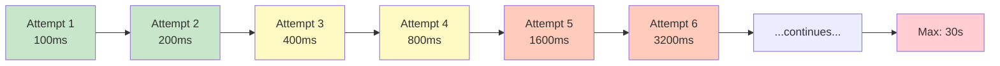
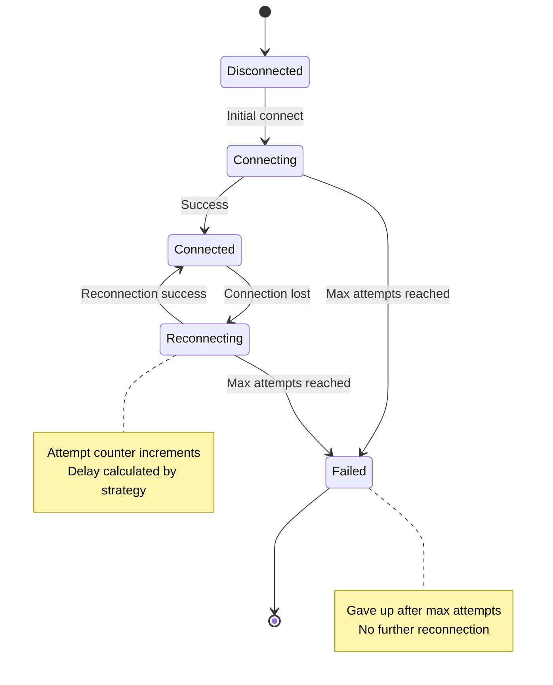

# Automatic Reconnection

JROW provides robust automatic reconnection capabilities for clients, ensuring your applications remain connected even in unstable network conditions.

## Features

- **Pluggable Strategies**: Choose from built-in strategies or implement your own
- **Automatic Resubscription**: Subscriptions are automatically restored after reconnection
- **Configurable Backoff**: Control retry timing and limits
- **Connection State Tracking**: Monitor connection status in real-time
- **Transparent to Application**: Pending requests are queued during reconnection

## Built-in Strategies

### Default Reconnection (Quick Start)

For most use cases, use the default reconnection strategy:

```rust
use jrow_client::ClientBuilder;

// Enable reconnection with sensible defaults
let client = ClientBuilder::new("ws://localhost:8080")
    .with_default_reconnect()
    .connect()
    .await?;
```

**Default Strategy**: `ExponentialBackoff` with:
- `min_delay`: 100ms
- `max_delay`: 30 seconds
- `max_attempts`: 10
- `jitter`: Enabled

This provides good balance between quick recovery and avoiding server overload for typical applications.

### Exponential Backoff (Custom Configuration)

For custom requirements, configure exponential backoff explicitly:

```rust
use jrow_client::{ClientBuilder, ExponentialBackoff};
use std::time::Duration;

let strategy = ExponentialBackoff::new(
    Duration::from_millis(100),  // min_delay
    Duration::from_secs(30),     // max_delay
)
.with_max_attempts(10)
.with_jitter();  // Prevents thundering herd

let client = ClientBuilder::new("ws://localhost:8080")
    .with_reconnect(Box::new(strategy))
    .connect()
    .await?;
```

**Parameters:**
- `min_delay`: Initial delay before first reconnection attempt
- `max_delay`: Maximum delay between attempts (caps exponential growth)
- `max_attempts`: Optional limit on total reconnection attempts
- `jitter`: Adds random 0-25% variance to prevent synchronized reconnections

**Delay Calculation:**
```
delay = min(min_delay * 2^attempt, max_delay) + jitter
```



### Fixed Delay

Simple strategy with constant delay between attempts:

```rust
use jrow_client::{ClientBuilder, FixedDelay};
use std::time::Duration;

let strategy = FixedDelay::new(Duration::from_secs(5))
    .with_max_attempts(20);

let client = ClientBuilder::new("ws://localhost:8080")
    .with_reconnect(Box::new(strategy))
    .connect()
    .await?;
```

### No Reconnection

Explicitly disable reconnection (default behavior):

```rust
use jrow_client::{ClientBuilder, NoReconnect};

let client = ClientBuilder::new("ws://localhost:8080")
    .with_reconnect(Box::new(NoReconnect))
    .connect()
    .await?;

// Or simply:
let client = ClientBuilder::new("ws://localhost:8080")
    .without_reconnect()
    .connect()
    .await?;
```

## Connection States



The client tracks its connection state, which you can query:

```rust
use jrow_client::ConnectionState;

if let Some(state) = client.connection_state().await {
    match state {
        ConnectionState::Disconnected => println!("Not connected"),
        ConnectionState::Connecting => println!("Initial connection in progress"),
        ConnectionState::Connected => println!("Connected and ready"),
        ConnectionState::Reconnecting { attempt } => {
            println!("Reconnecting (attempt {})", attempt)
        }
        ConnectionState::Failed => println!("Reconnection failed (gave up)"),
    }
}

// Simple check
if client.is_connected().await {
    println!("Client is connected");
}
```

## Custom Reconnection Strategies

Implement the `ReconnectionStrategy` trait for custom behavior:

```rust
use jrow_client::ReconnectionStrategy;
use std::time::Duration;

struct CustomStrategy {
    attempts: Vec<Duration>,
    current: usize,
}

impl ReconnectionStrategy for CustomStrategy {
    fn next_delay(&mut self, attempt: u32) -> Option<Duration> {
        self.attempts.get(attempt as usize).copied()
    }

    fn reset(&mut self) {
        self.current = 0;
    }
}

// Use it
let strategy = CustomStrategy {
    attempts: vec![
        Duration::from_secs(1),
        Duration::from_secs(2),
        Duration::from_secs(5),
        Duration::from_secs(10),
    ],
    current: 0,
};

let client = ClientBuilder::new("ws://localhost:8080")
    .with_reconnect(Box::new(strategy))
    .connect()
    .await?;
```

## Automatic Resubscription

When a connection is lost and reestablished, JROW automatically:

1. Reconnects to the server using the configured strategy
2. Resubscribes to all previously subscribed topics
3. Restores notification handlers

```mermaid
sequenceDiagram
    participant C as Client
    participant S as Server
    
    Note over C,S: Initial Connection
    C->>S: Connect
    C->>S: subscribe("events")
    S-->>C: Subscription confirmed
    
    Note over C,S: Connection Lost
    S-xC: Connection dropped
    C->>C: Detect disconnection
    C->>C: State: Reconnecting
    
    Note over C,S: Reconnection Attempt 1
    C->>C: Wait: min_delay
    C->>S: Reconnect attempt
    S-xC: Failed
    
    Note over C,S: Reconnection Attempt 2
    C->>C: Wait: min_delay * 2
    C->>S: Reconnect attempt
    S-->>C: Connected!
    
    Note over C,S: Automatic Resubscription
    C->>S: subscribe("events")
    S-->>C: Subscription restored
    C->>C: State: Connected
    
    Note over C,S: Resume Normal Operation
    S->>C: Event notifications
    
    style C fill:#E3F2FD
    style S fill:#C8E6C9
```

This is transparent to your application:

```rust
// Subscribe once
client.subscribe("events", |msg| async move {
    println!("Event: {}", msg);
}).await?;

// Even if the connection is lost and restored,
// the subscription and handler remain active
```

## Best Practices

### 1. Choose Appropriate Strategy

- **Production (typical)**: Use `with_default_reconnect()` for sensible defaults
- **Production (custom needs)**: Use `ExponentialBackoff` with jitter and custom parameters
- **Development**: Use `FixedDelay` for predictable behavior
- **Testing**: Use `NoReconnect` or very short delays

### 2. Set Reasonable Limits

```rust
let strategy = ExponentialBackoff::default()
    .with_max_attempts(10)  // Don't retry forever
    .with_jitter();         // Prevent thundering herd
```

### 3. Monitor Connection State

```rust
// Spawn a monitoring task
tokio::spawn(async move {
    loop {
        tokio::time::sleep(Duration::from_secs(30)).await;
        if let Some(state) = client.connection_state().await {
            log::info!("Connection state: {:?}", state);
        }
    }
});
```

### 4. Handle Failed Reconnections

```rust
use jrow_client::ConnectionState;

if let Some(ConnectionState::Failed) = client.connection_state().await {
    // Reconnection abandoned - take action
    log::error!("Failed to reconnect after maximum attempts");
    // Maybe create a new client or alert monitoring
}
```

### 5. Consider Network Conditions

For unstable networks:
```rust
let strategy = ExponentialBackoff::new(
    Duration::from_secs(2),   // Longer initial delay
    Duration::from_secs(60),  // Longer max delay
)
.with_max_attempts(20)        // More attempts
.with_jitter();
```

For stable networks:
```rust
let strategy = ExponentialBackoff::new(
    Duration::from_millis(100),  // Quick initial retry
    Duration::from_secs(10),     // Shorter max delay
)
.with_max_attempts(5)            // Fewer attempts
.with_jitter();
```

## Example: Resilient Client

```rust
use jrow_client::{ClientBuilder, ExponentialBackoff, ConnectionState};
use std::time::Duration;

#[tokio::main]
async fn main() -> Result<(), Box<dyn std::error::Error>> {
    // Create client with reconnection
    let strategy = ExponentialBackoff::default();
    let client = ClientBuilder::new("ws://localhost:8080")
        .with_reconnect(Box::new(strategy))
        .connect()
        .await?;

    // Subscribe to events
    client.subscribe("updates", |msg| async move {
        println!("Update: {}", msg);
    }).await?;

    // Monitor connection in background
    let client_clone = client.clone();
    tokio::spawn(async move {
        loop {
            tokio::time::sleep(Duration::from_secs(10)).await;
            match client_clone.connection_state().await {
                Some(ConnectionState::Connected) => {
                    println!("✓ Connected");
                }
                Some(ConnectionState::Reconnecting { attempt }) => {
                    println!("⟳ Reconnecting (attempt {})", attempt);
                }
                Some(ConnectionState::Failed) => {
                    println!("✗ Connection failed");
                    break;
                }
                _ => {}
            }
        }
    });

    // Use the client normally
    loop {
        match client.request::<_, String>("ping", "hello").await {
            Ok(response) => println!("Response: {}", response),
            Err(e) => println!("Error: {} (will retry)", e),
        }
        tokio::time::sleep(Duration::from_secs(5)).await;
    }
}
```

## Testing Reconnection

Run the example to see reconnection in action:

```bash
# Terminal 1: Start the server
cargo run --example reconnection_server

# Terminal 2: Start the client
cargo run --example reconnection

# Terminal 1: Stop the server (Ctrl+C), wait a few seconds, then restart
# The client will automatically reconnect and resubscribe
```

## Performance Considerations

### Memory

Each client with reconnection enabled maintains:
- Connection state (~100 bytes)
- Reconnection strategy state (~50-200 bytes)
- Subscribed topics list (varies)

### CPU

Reconnection logic is minimal:
- State transitions: O(1)
- Delay calculation: O(1) for exponential backoff
- Resubscription: O(n) where n = number of subscribed topics

### Network

- Reconnection attempts are rate-limited by the strategy
- Jitter prevents synchronized reconnections from multiple clients
- Failed attempts don't generate excessive traffic

## Limitations

1. **Pending Requests**: Requests sent during disconnection will timeout (not queued)
2. **Manual Reconnection**: No API to manually trigger reconnection
3. **Connection Quality**: No automatic detection of degraded connections
4. **State Synchronization**: Application state must be managed separately

## Future Enhancements

- Request queuing during reconnection
- Connection quality monitoring
- Adaptive strategy selection
- Persistent subscriptions across restarts

